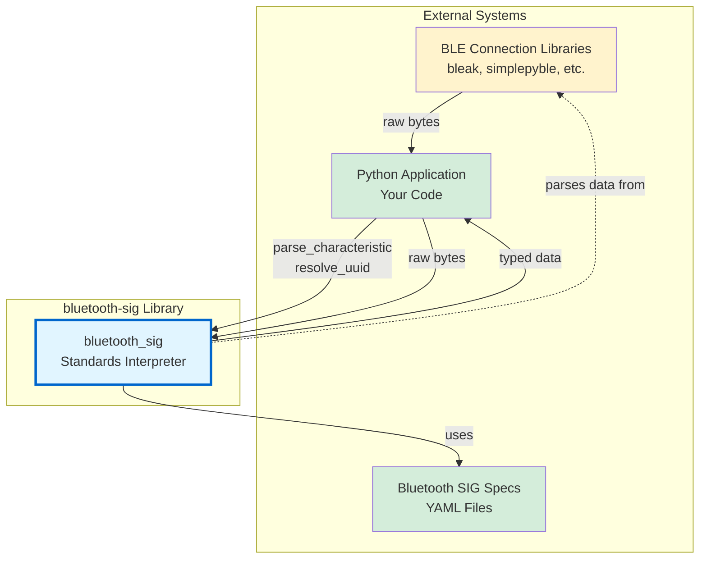
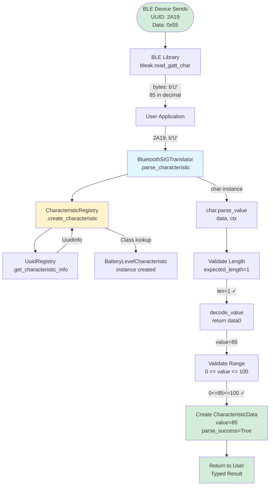
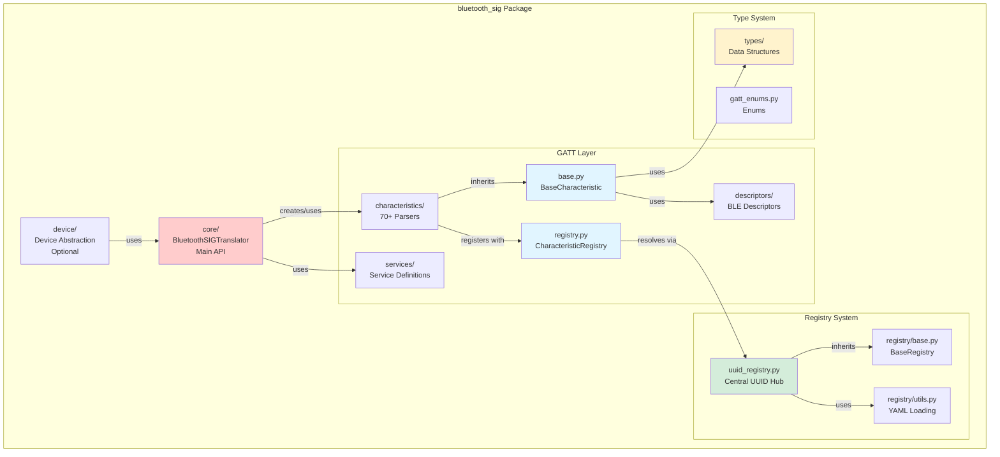
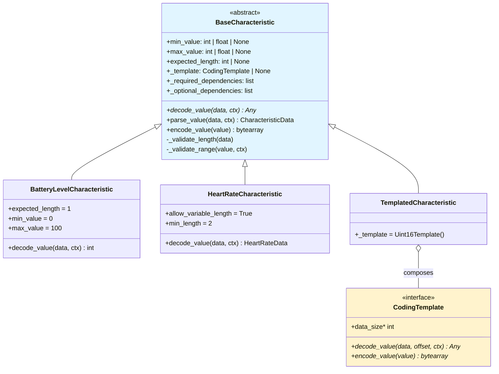
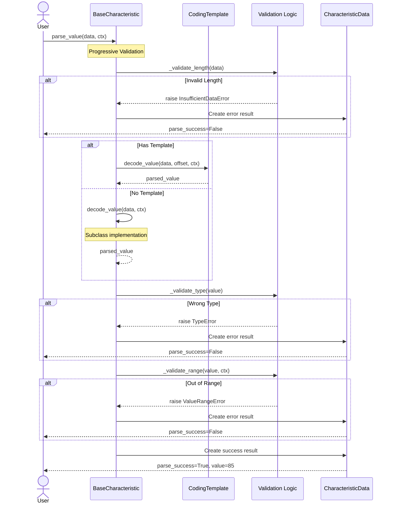

# Internal Architecture Guide

!!! info "Audience"
    This guide is for **contributors and maintainers** who need to understand the internal implementation details of the bluetooth-sig-python library. If you're looking to use the library in your project, see the [User Guides](../../guides/ble-integration.md) instead.

## Overview

The internal architecture of bluetooth-sig-python is built around registry-driven characteristic resolution, template-based parsing composition, and strict separation between standards interpretation and BLE connectivity. This guide covers the implementation details of the core systems that power the library.

## System Context (C4 Model - Context Level)



## Complete Data Flow: Raw Bytes → Typed Data



## Package Structure (C4 Model - Container Level)



## BaseCharacteristic: The Foundation

### Purpose and Design

**Location**: `src/bluetooth_sig/gatt/characteristics/base.py` (1115 lines)

`BaseCharacteristic` is the abstract base class for all GATT characteristic parsers.

### Class Hierarchy



### Parsing Flow with Validation



### Declarative Validation Pattern

Instead of manual validation in `decode_value()`, characteristics declare constraints as class attributes:

```python
from bluetooth_sig.gatt.characteristics.base import BaseCharacteristic
from bluetooth_sig.gatt.exceptions import InsufficientDataError, ValueRangeError

# Before: Manual validation (verbose, error-prone)
class BatteryLevelCharacteristic(BaseCharacteristic):
    def decode_value(self, data: bytearray) -> int:
        if len(data) != 1:
            raise InsufficientDataError("Battery level data must be 1 byte")
        level = data[0]
        if not 0 <= level <= 100:
            raise ValueRangeError(f"Battery level must be 0-100, got {level}")
        return level

# After: Declarative validation (concise, consistent)
class BatteryLevelCharacteristic(BaseCharacteristic):
    expected_length = 1
    min_value = 0
    max_value = 100
    expected_type = int

    def decode_value(self, data: bytearray) -> int:
        return data[0]  # Validation happens automatically
```

### Template Composition System

**Location**: `src/bluetooth_sig/gatt/characteristics/templates.py`

Templates are reusable parsing strategies that can be composed into characteristics via the `_template` attribute:

```python
from abc import ABC, abstractmethod

class CodingTemplate(ABC):
    """Abstract base for reusable parsing strategies."""

    @abstractmethod
    def decode_value(self, data: bytearray, offset: int = 0,
                     ctx: CharacteristicContext | None = None) -> Any:
        """Decode raw bytes to typed value."""

    @abstractmethod
    def encode_value(self, value: Any) -> bytearray:
        """Encode typed value to raw bytes."""

    @property
    @abstractmethod
    def data_size(self) -> int:
        """Size of data in bytes."""
```

**Built-in Templates**:

- **Integer**: `Uint8Template`, `Uint16Template`, `Uint24Template`, `Uint32Template`, `Sint8Template`, `Sint16Template`, `Sint24Template`
- **Float**: `Float32Template`, `Float64Template`, `IEEE11073Template`
- **String**: `Utf8StringTemplate`
- **Specialized**: `PercentageTemplate`, `TemperatureTemplate`, `HumidityTemplate`

**Usage Example**:

```python
from bluetooth_sig.gatt.characteristics.base import BaseCharacteristic
from bluetooth_sig.gatt.characteristics.templates import Uint16Template

# Simple characteristic using template composition
class ApparentWindSpeedCharacteristic(BaseCharacteristic):
    _template = Uint16Template()  # Reuse template, no decode_value() needed
    expected_length = 2
```

### CharacteristicData: Parse Result Container

```python
import msgspec
from bluetooth_sig.gatt.characteristics.base import BaseCharacteristic
from bluetooth_sig.types import ParseFieldError
from bluetooth_sig.types.uuid import BluetoothUUID

class CharacteristicData(msgspec.Struct, kw_only=True):
    """Parse result with back-reference to characteristic."""

    characteristic: BaseCharacteristic  # Back-reference
    value: Any | None = None           # Parsed value
    raw_data: bytes = b""              # Original bytes
    parse_success: bool = False        # Success flag
    error_message: str = ""            # Error description
    field_errors: list[ParseFieldError] = []  # Field-level errors
    parse_trace: list[str] = []        # Debug trace steps

    # Convenience properties (proxy to characteristic)
    @property
    def name(self) -> str:
        return self.characteristic.name

    @property
    def uuid(self) -> BluetoothUUID:
        return self.characteristic.uuid
```

## CharacteristicRegistry: Discovery and Lookup

### Purpose

**Location**: `src/bluetooth_sig/gatt/characteristics/registry.py` (357 lines)

The `CharacteristicRegistry` provides:

1. **Lazy Discovery** - Automatic discovery of characteristic classes via `pkgutil.walk_packages`
2. **UUID Resolution** - UUID → CharacteristicName enum → implementation class
3. **Name Resolution** - Display name → UUID → implementation class
4. **Thread Safety** - Double-checked locking for concurrent access
5. **Custom Registration** - Runtime registration of custom characteristics

### Data Structures

```python
import threading
from bluetooth_sig.gatt.characteristics.base import BaseCharacteristic
from bluetooth_sig.gatt.characteristics.registry import CharacteristicName
from bluetooth_sig.gatt.uuid_registry import UuidInfo

# Core registry mapping
CHARACTERISTIC_CLASS_MAP: dict[CharacteristicName, type[BaseCharacteristic]] = {}

# UUID lookup cache (built lazily)
_uuid_to_enum_cache: dict[str, CharacteristicName] = {}

# Thread safety
_registry_lock = threading.RLock()
_registry_initialized = False
```

### Discovery Process

```python
class CharacteristicRegistry:
    @classmethod
    def _discover_characteristics(cls) -> None:
        """Lazily discover all characteristic classes via pkgutil."""
        global _registry_initialized

        if _registry_initialized:
            return

        with _registry_lock:
            if _registry_initialized:  # Double-check
                return

            # Walk package tree and import modules
            for module in ModuleDiscovery.iter_module_names():
                # Import triggers class registration
                import_module(f"bluetooth_sig.gatt.characteristics.{module}")

            _registry_initialized = True
```

### Lookup Methods

```python
from bluetooth_sig.gatt.characteristics.registry import CharacteristicRegistry, CharacteristicName

# Create characteristic instance from UUID
char = CharacteristicRegistry.create_characteristic("2A19")

# Get characteristic class from UUID
CharClass = CharacteristicRegistry.get_characteristic_class_by_uuid("2A19")

# Get characteristic class from enum
CharClass = CharacteristicRegistry.get_characteristic_class(
    CharacteristicName.BATTERY_LEVEL
)
```

### Thread Safety Pattern

**Double-Checked Locking**:

- First check: No lock (fast path for initialized registry)
- Second check: With lock (prevents race during initialization)
- Initialization: Happens exactly once, thread-safe

**Why this pattern?**

- **Performance**: Most accesses skip lock acquisition
- **Safety**: No race conditions during initialization
- **Lazy**: Only loads when first characteristic is created

## UUID Resolution System

### UuidRegistry: YAML-Based Resolution

**Location**: `src/bluetooth_sig/gatt/uuid_registry.py` (821 lines)

The `UuidRegistry` loads UUID mappings from Bluetooth SIG YAML files in the `bluetooth_sig/` git submodule.

### YAML Sources

```text
bluetooth_sig/assigned_numbers/
├── uuids/
│   ├── characteristic_uuids.yaml  # SIG characteristic UUIDs
│   ├── service_uuids.yaml         # SIG service UUIDs
│   ├── descriptors.yaml           # BLE descriptor UUIDs
│   └── units.yaml                 # Unit definitions
├── core/
│   ├── ad_types.yaml              # Advertising data types
│   ├── appearance_values.yaml     # Device appearance codes
│   └── class_of_device.yaml       # Class of Device (CoD)
└── company_identifiers/
    └── company_identifiers.yaml   # Manufacturer IDs
```

### CharacteristicSpec Structure

```python
import msgspec
from bluetooth_sig.types.uuid import BluetoothUUID
from bluetooth_sig.gatt.uuid_registry import FieldInfo, UnitInfo

class CharacteristicSpec(msgspec.Struct, kw_only=True):
    """Characteristic specification from cross-file YAML references."""

    uuid: BluetoothUUID
    name: str
    field_info: FieldInfo    # data_type, field_size
    unit_info: UnitInfo      # unit_symbol, base_unit, resolution
    description: str | None = None

class FieldInfo(msgspec.Struct, frozen=True, kw_only=True):
    """Field-related metadata from YAML."""
    data_type: str | None = None
    field_size: str | None = None

class UnitInfo(msgspec.Struct, frozen=True, kw_only=True):
    """Unit-related metadata from YAML."""
    unit_id: str | None = None
    unit_symbol: str | None = None
    base_unit: str | None = None
    resolution_text: str | None = None
```

### Lazy Loading with Caching

```python
class UuidRegistry:
    _loaded = False
    _lock = threading.RLock()

    def _load_uuids(self) -> None:
        """Load YAML files on first access."""
        if self._loaded:
            return

        with self._lock:
            if self._loaded:  # Double-check
                return

            # Find bluetooth_sig/ submodule
            sig_path = find_bluetooth_sig_path()
            if not sig_path:
                logger.warning("Bluetooth SIG submodule not found")
                self._loaded = True
                return

            # Load YAML files
            char_yaml = sig_path / "uuids" / "characteristic_uuids.yaml"
            for uuid_data in load_yaml_uuids(char_yaml):
                # Parse and store UUID info
                ...

            self._loaded = True
```

### Resolution Hierarchy

**SIGCharacteristicResolver** uses a fallback chain:

```text
1. YAML Cross-File Resolution (Preferred)
   ↓ Detailed specs with field info, unit info, data types
   ↓ Source: GSS (GATT Specification Supplement) YAML files

2. Basic Registry Resolution (Fallback)
   ↓ Simple UUID → name mapping
   ↓ Faster, less detailed

3. Hardcoded _info Attribute (Custom Only)
   ↓ For vendor-specific characteristics not in SIG registry
   ↓ Defined in custom characteristic classes
```

## Resolver: Name Normalization and Variants

**Location**: `src/bluetooth_sig/gatt/resolver.py`

### NameNormalizer

Converts between different name formats:

```python
class NameNormalizer:
    @staticmethod
    def camel_case_to_display_name(name: str) -> str:
        """BatteryLevelCharacteristic → Battery Level"""
        # Remove "Characteristic" suffix
        # Insert spaces before capitals
        # Handle acronyms (HTTP, UUID, etc.)
```

### NameVariantGenerator

Generates all possible name variations for lookup:

```python
class NameVariantGenerator:
    @staticmethod
    def generate_characteristic_variants(class_name: str, display_name: str) -> list[str]:
        """Generate lookup keys for a characteristic.

        Example:
            class_name = "BatteryLevelCharacteristic"
            display_name = "Battery Level"

        Returns:
            ["BatteryLevelCharacteristic",
             "Battery Level Characteristic",
             "Battery Level",
             "battery_level",
             "BATTERY_LEVEL"]
        """
```

### CharacteristicRegistrySearch

Fuzzy matching for characteristic lookup:

```python
class CharacteristicRegistrySearch:
    @staticmethod
    def find_characteristic_by_fuzzy_name(search_term: str) -> type[BaseCharacteristic] | None:
        """Search registry with fuzzy matching.

        Handles:
        - Case insensitivity
        - Underscore/space variations
        - Partial matches
        - Special characters
        """
```

## BluetoothSIGTranslator: The Singleton API

**Location**: `src/bluetooth_sig/core/translator.py` (935 lines)

### Singleton Pattern

```python
class BluetoothSIGTranslator:
    _instance: BluetoothSIGTranslator | None = None
    _instance_lock: bool = False

    def __new__(cls) -> BluetoothSIGTranslator:
        """Create or return singleton instance."""
        if cls._instance is None:
            cls._instance = super().__new__(cls)
        return cls._instance
```

### Key Methods

**Parsing**:

```python
def parse_characteristic(
    self,
    uuid: str | BluetoothUUID,
    data: bytes | bytearray,
    ctx: CharacteristicContext | None = None
) -> CharacteristicData:
    """Parse characteristic data using SIG specifications."""
```

**UUID Resolution**:

```python
def get_characteristic_info(self, identifier: str | BluetoothUUID) -> CharacteristicInfo | None:
    """Get characteristic metadata by UUID or name."""

def get_characteristic_uuid_by_name(self, name: CharacteristicName) -> BluetoothUUID | None:
    """Resolve characteristic name to UUID."""
```

**Service Operations**:

```python
def create_service(self, uuid: str | BluetoothUUID) -> BaseGattService:
    """Create service instance from UUID."""

def process_services(
    self,
    services: Mapping[str, Mapping[str, bytes]],
    ctx: CharacteristicContext | None = None
) -> dict[str, dict[str, CharacteristicData]]:
    """Parse all characteristics in all services."""
```

**Custom Registration**:

```python
def register_custom_characteristic(
    self,
    uuid: str,
    char_cls: type[BaseCharacteristic],
    override: bool = False
) -> None:
    """Register custom characteristic at runtime."""
```

## Progressive API Levels

The library supports 4 progressive levels of sophistication:

### Level 1: Basic Parsing (Required)

**Minimum implementation** - just implement `decode_value()`:

```python
from bluetooth_sig.gatt.characteristics.base import BaseCharacteristic

class MinimalCharacteristic(BaseCharacteristic):
    def decode_value(self, data: bytearray) -> int:
        return data[0]
```

### Level 2: Declarative Validation (Optional)

**Add validation attributes**:

```python
from bluetooth_sig.gatt.characteristics.base import BaseCharacteristic

class ValidatedCharacteristic(BaseCharacteristic):
    expected_length = 2
    min_value = 0
    max_value = 65535
    expected_type = int

    def decode_value(self, data: bytearray) -> int:
        return int.from_bytes(data, byteorder='little')
```

### Level 3: Template Composition (Optional)

**Use reusable template**:

```python
from bluetooth_sig.gatt.characteristics.base import BaseCharacteristic
from bluetooth_sig.gatt.characteristics.templates import Uint16Template

class TemplatedCharacteristic(BaseCharacteristic):
    _template = Uint16Template()
    # No decode_value() needed - template handles it
```

### Level 4: Dependency Resolution (Optional)

**Multi-characteristic parsing**:

```python
# SKIP: Conceptual example - ContextInfoCharacteristic would be a real characteristic class
from bluetooth_sig.gatt.characteristics.base import BaseCharacteristic
from bluetooth_sig.gatt.context import CharacteristicContext

class DependentCharacteristic(BaseCharacteristic):
    _required_dependencies = [ContextInfoCharacteristic]

    def decode_value(self, data: bytearray, ctx: CharacteristicContext) -> int:
        # Access dependency from context
        context_info = ctx.dependencies.get("context_info")
        # Use dependency to enrich parsing
        return data[0] if context_info else 0
```

## Descriptor System

**Location**: `src/bluetooth_sig/gatt/descriptor_utils.py`

BLE descriptors provide runtime metadata about characteristics. The library integrates descriptors for enhanced validation and dynamic behaviour.

### Descriptor Types

```python
from bluetooth_sig.gatt.descriptors import (
    CCCDDescriptor,
    CharacteristicPresentationFormatDescriptor,
    ValidRangeDescriptor,
    CharacteristicUserDescriptionDescriptor
)

# Client Characteristic Configuration Descriptor (CCCD)
cccd = CCCDDescriptor()

# Characteristic Presentation Format
format_desc = CharacteristicPresentationFormatDescriptor()

# Valid Range Descriptor
range_desc = ValidRangeDescriptor()

# User Description Descriptor
description_desc = CharacteristicUserDescriptionDescriptor()
```

### Descriptor Access Pattern

```python
# In characteristic implementation
def _validate_range(self, value: float, ctx: CharacteristicContext) -> None:
    # Try descriptor-based validation first
    valid_range = get_valid_range_from_context(ctx, self.uuid)
    if valid_range:
        min_val, max_val = valid_range
        if not (min_val <= value <= max_val):
            raise ValueRangeError(f"Value {value} outside valid range [{min_val}, {max_val}]")
    else:
        # Fallback to declarative validation
        if self.min_value is not None and value < self.min_value:
            raise ValueRangeError(f"Value {value} below minimum {self.min_value}")
```

## Exception Hierarchy

**Location**: `src/bluetooth_sig/gatt/exceptions.py`

```python
class GattError(Exception):
    """Base exception for GATT layer."""

class ParseFieldError(GattError):
    """Field-level parsing error."""
    field_name: str
    field_value: Any
    expected_type: type | None

class InsufficientDataError(GattError):
    """Not enough bytes to parse."""
    required_bytes: int
    available_bytes: int

class ValueRangeError(GattError):
    """Value outside valid range."""
    value: Any
    min_value: Any | None
    max_value: Any | None

class UUIDResolutionError(GattError):
    """UUID not found in registry."""
    uuid: str

class MissingDependencyError(GattError):
    """Required dependent characteristic not available."""
    dependency_uuid: str
```

## Key Design Patterns

### 1. Registry Pattern

- **CharacteristicRegistry**: Global UUID → class lookup
- **Lazy Discovery**: Load on first access
- **Thread-Safe**: Double-checked locking

### 2. Singleton Pattern

- **BluetoothSIGTranslator**: Single global instance
- **UuidRegistry**: Single YAML loader
- **BaseRegistry**: All registries are singletons

### 3. Template Method Pattern

- **BaseCharacteristic.parse_value()**: Orchestrates validation + decoding
- Subclasses implement `decode_value()`
- Base class handles error wrapping

### 4. Composition over Inheritance

- **CodingTemplate**: Inject via `_template` attribute
- No deep inheritance hierarchies
- Reusable parsing strategies

### 5. Declarative Configuration

- **Validation attributes**: `expected_length`, `min_value`, `max_value`
- **Dependency attributes**: `_required_dependencies`, `_optional_dependencies`
- Reduces boilerplate, increases consistency

### 6. Progressive Enhancement

- **Level 1-4 API**: Start simple, add features as needed
- Backward compatible
- Low barrier to entry

## Architectural Decisions

For detailed explanations of key architectural decisions (why registry-driven resolution, double-checked locking, template composition, etc.), see [Architectural Decision Records](../decisions.md).

## Performance Characteristics

### Initialization

| Operation | Time | Notes |
|-----------|------|-------|
| First characteristic access | 10-50ms | One-time registry discovery |
| YAML loading (first UUID lookup) | 10-30ms | One-time YAML parsing |
| Subsequent accesses | <0.1ms | Cached lookups |

### Memory Footprint

| Component | Size | Notes |
|-----------|------|-------|
| Base registry | 500KB-1MB | All Bluetooth SIG UUIDs |
| Per characteristic | 100-200 bytes | UuidInfo struct |
| Per alias | ~50 bytes | String → string mapping |

### Parsing Performance

| Characteristic Type | Time | Notes |
|---------------------|------|-------|
| Simple (Battery Level) | 1-2 µs | Single byte, range check |
| Template-based (Uint16) | 2-3 µs | Template delegation overhead |
| Complex (Heart Rate) | 5-10 µs | Conditional parsing, multiple fields |

### Thread Contention

- **Lock acquisition**: Only during first access
- **Read operations**: Lock-free after initialization
- **Concurrent reads**: Unlimited parallelism

## Performance Considerations

### Lazy Loading


- **Registry discovery**: Only on first characteristic creation
- **YAML loading**: Only on first UUID resolution
- **Module imports**: Only when characteristic is needed

### Caching

- **UUID → Enum mapping**: `@lru_cache` on lookup functions
- **Name normalization**: `@lru_cache` on variant generation
- **Descriptor data**: Cached in `CharacteristicContext`

### msgspec Structs

- **Fast serialization**: msgspec is 5-10x faster than dataclasses
- **Memory efficient**: Compact representation
- **Type validated**: Runtime type checking

### Thread Safety

- **Double-checked locking**: Minimize lock contention
- **Read-heavy workload**: Most operations are lock-free reads
- **Singleton registries**: Shared state, protected by locks

## Next Steps

- **[Registry System Deep Dive](registry-system.md)** - How YAML loading works
- **[Architectural Decisions](../decisions.md)** - Why key design choices were made
- **[Adding Characteristics](../../guides/adding-characteristics.md)** - Step-by-step implementation guide
