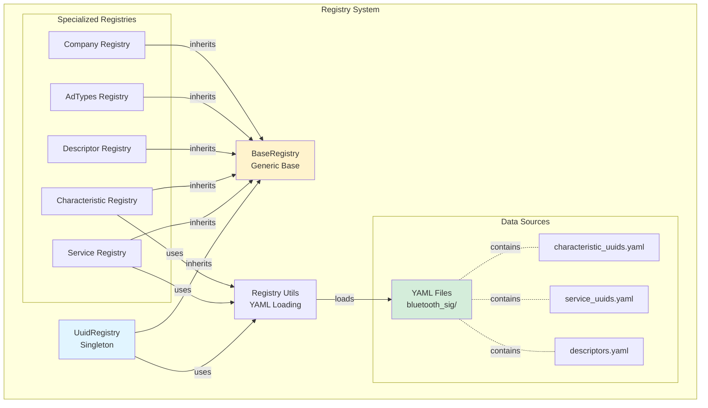
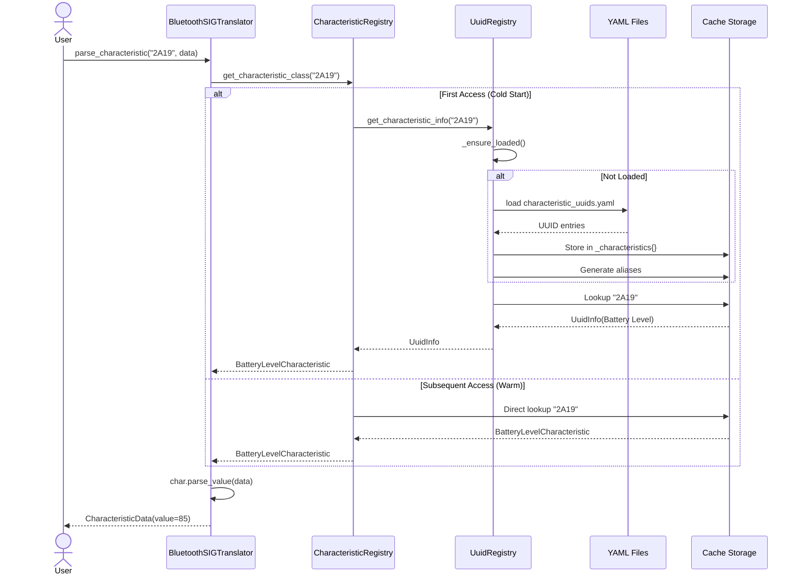
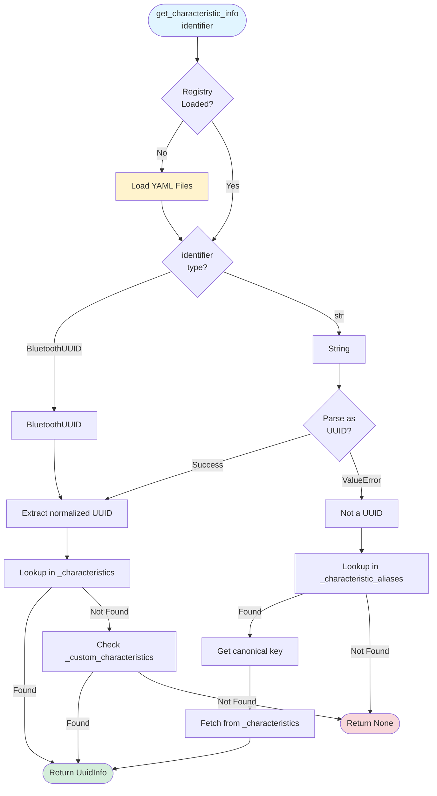

# Registry System Deep Dive

!!! info "Audience"
    This guide is for **contributors and maintainers** who need to understand how the Bluetooth SIG registry system works. For general usage, see the [User Guides](../../guides/ble-integration.md).

## Overview

The registry system is the foundation for UUID resolution in bluetooth-sig-python. It loads official Bluetooth SIG specifications from YAML files and provides thread-safe, cached lookups for characteristics, services, descriptors, and related metadata.

## Component Architecture (C4 Model - Component Level)



## Data Flow: UUID Resolution



## The bluetooth_sig Git Submodule

### Critical Dependency

**The `bluetooth_sig/` git submodule MUST be initialized before the library can resolve UUIDs.**

From the project instructions:

> The registry system (`src/bluetooth_sig/gatt/uuid_registry.py`) loads UUID mappings from `bluetooth_sig/assigned_numbers/uuids/*.yaml`. Without the submodule, characteristic parsing and UUID resolution will fail at runtime.

### Initialization

```bash
# First time setup
git submodule init
git submodule update

# Or combined
git submodule update --init

# Verify
python -c "import bluetooth_sig; print('✅ Ready')"
```

### Search Paths

The registry searches in two locations:

```python
def find_bluetooth_sig_path() -> Path | None:
    """Find the Bluetooth SIG assigned_numbers directory."""
    # 1. Development location (git submodule)
    project_root = Path(__file__).parent.parent.parent.parent
    base_path = project_root / "bluetooth_sig" / "assigned_numbers" / "uuids"

    if base_path.exists():
        return base_path

    # 2. Installed package location
    pkg_root = Path(__file__).parent.parent
    base_path = pkg_root / "bluetooth_sig" / "assigned_numbers" / "uuids"

    return base_path if base_path.exists() else None
```

**Path Priority**:

1. **Development**: `<project_root>/bluetooth_sig/assigned_numbers/uuids/` (submodule)
2. **Installed**: `<site-packages>/bluetooth_sig/assigned_numbers/uuids/` (packaged)

## UuidRegistry: The Central Hub

**Location**: `src/bluetooth_sig/gatt/uuid_registry.py` (821 lines)

### Purpose

`UuidRegistry` is a **singleton** that:

1. Loads all Bluetooth SIG UUIDs from YAML files
2. Provides fast lookup by UUID, name, or ID
3. Caches results for performance
4. Supports custom UUID registration
5. Handles alias generation for flexible lookup

### Data Structures

```python
import threading
from bluetooth_sig.registry.base import BaseRegistry
from bluetooth_sig.gatt.uuid_registry import UuidInfo, UnitInfo

class UuidRegistry(BaseRegistry):
    """Central UUID registry for all Bluetooth SIG UUIDs."""

    # Core storage (canonical keys)
    _services: dict[str, UuidInfo] = {}
    _characteristics: dict[str, UuidInfo] = {}
    _descriptors: dict[str, UuidInfo] = {}
    _units: dict[str, UnitInfo] = {}

    # Alias mappings (lightweight, point to canonical keys)
    _service_aliases: dict[str, str] = {}
    _characteristic_aliases: dict[str, str] = {}
    _descriptor_aliases: dict[str, str] = {}

    # Custom registrations (runtime)
    _custom_characteristics: dict[str, UuidInfo] = {}
    _custom_services: dict[str, UuidInfo] = {}

    # Thread safety
    _lock = threading.RLock()
    _loaded = False
```

### UuidInfo Structure

```python
import msgspec
from bluetooth_sig.types.uuid import BluetoothUUID
from bluetooth_sig.gatt.uuid_registry import UuidOrigin

class UuidInfo(msgspec.Struct, frozen=True, kw_only=True):
    """Information about a UUID."""

    uuid: BluetoothUUID  # Normalized UUID
    name: str            # Display name (e.g., "Battery Level")
    id: str              # Org ID (e.g., "org.bluetooth.characteristic.battery_level")
    summary: str = ""    # Brief description
    unit: str | None = None       # Unit of measurement
    value_type: str | None = None # Data type
    origin: UuidOrigin = UuidOrigin.BLUETOOTH_SIG
```

### CharacteristicSpec Structure

For characteristics, a richer `CharacteristicSpec` is available:

```python
import msgspec
from bluetooth_sig.types.uuid import BluetoothUUID
from bluetooth_sig.gatt.uuid_registry import FieldInfo, UnitInfo

class CharacteristicSpec(msgspec.Struct, kw_only=True):
    """Characteristic specification from cross-file YAML references."""

    uuid: BluetoothUUID
    name: str
    field_info: FieldInfo    # data_type, field_size
    unit_info: UnitInfo      # unit_symbol, base_unit, resolution
    description: str | None = None

class FieldInfo(msgspec.Struct, frozen=True, kw_only=True):
    """Field-related metadata from YAML."""
    data_type: str | None = None
    field_size: str | None = None

class UnitInfo(msgspec.Struct, frozen=True, kw_only=True):
    """Unit-related metadata from YAML."""
    unit_id: str | None = None
    unit_symbol: str | None = None
    base_unit: str | None = None
    resolution_text: str | None = None
```

## Lazy Loading Pattern

### Double-Checked Locking

The registry uses **double-checked locking** for thread-safe lazy initialization:

```python
def _ensure_loaded(self) -> None:
    """Ensure registry is loaded (thread-safe lazy loading)."""
    # First check: no lock (fast path)
    if self._loaded:
        return

    # Acquire lock for initialization
    with self._lock:
        # Second check: after lock (prevent race condition)
        if self._loaded:
            return

        # Perform actual loading
        self._load()
        self._loaded = True
```

### State Machine Diagram

```mermaid
stateDiagram-v2
    [*] --> Uninitialized
    Uninitialized --> CheckingLoad : First Access
    CheckingLoad --> AcquiringLock : Not Loaded
    CheckingLoad --> Loaded : Already Loaded (Fast Path)

    AcquiringLock --> DoubleCheck : Lock Acquired
    DoubleCheck --> Loading : Still Not Loaded
    DoubleCheck --> Loaded : Another Thread Loaded

    Loading --> ParsingYAML : Read Files
    ParsingYAML --> BuildingIndex : Parse Entries
    BuildingIndex --> GeneratingAliases : Create Mappings
    GeneratingAliases --> Loaded : Set _loaded=True

    Loaded --> [*]

    note right of CheckingLoad
        Lock-free check
        O(1) constant time
    end note

    note right of Loading
        Only happens once
        10-50ms typical
    end note

    note right of Loaded
        All future accesses
        Skip directly here
    end note
```### Why Double-Checked Locking?

**Performance Benefits**:

- **Fast Path**: After initialization, `_loaded` check succeeds immediately (no lock)
- **Cold Start**: First access acquires lock once, subsequent accesses skip lock
- **Thread Safe**: No race conditions during initialization

**Memory Efficiency**:

- Data loaded **only once** even with concurrent access
- All threads share the same registry instance (singleton)

### Loading Process

```python
def _load_uuids(self) -> None:
    """Load all UUIDs from YAML files."""
    base_path = find_bluetooth_sig_path()
    if not base_path:
        logger.warning("Bluetooth SIG submodule not found")
        return

    # Load service UUIDs
    service_yaml = base_path / "service_uuids.yaml"
    if service_yaml.exists():
        for uuid_info in load_yaml_uuids(service_yaml):
            uuid = normalize_uuid_string(uuid_info["uuid"])
            bt_uuid = BluetoothUUID(uuid)
            info = UuidInfo(
                uuid=bt_uuid,
                name=uuid_info["name"],
                id=uuid_info["id"],
                origin=UuidOrigin.BLUETOOTH_SIG
            )
            self._store_service(info)

    # Load characteristic UUIDs
    characteristic_yaml = base_path / "characteristic_uuids.yaml"
    # ... similar process

    # Load descriptor UUIDs
    descriptor_yaml = base_path / "descriptors.yaml"
    # ... similar process

    # Load unit definitions
    units_yaml = base_path.parent / "units.yaml"
    # ... similar process
```

## Alias System

### Flexible Lookup

The alias system enables flexible UUID lookup using various identifiers:

- **UUID**: `"2A19"`, `"0x2A19"`, `"00002A19-0000-1000-8000-00805F9B34FB"`
- **Name**: `"Battery Level"`, `"battery level"`, `"battery_level"`
- **Org ID**: `"org.bluetooth.characteristic.battery_level"`

### Storage Strategy

**Canonical Storage + Lightweight Aliases**:

```python
def _store_characteristic(self, info: UuidInfo) -> None:
    """Store characteristic info with canonical storage + aliases."""
    canonical_key = info.uuid.normalized

    # Store once in canonical location
    self._characteristics[canonical_key] = info

    # Create lightweight alias mappings (normalized to lowercase)
    aliases = self._generate_aliases(info)
    for alias in aliases:
        self._characteristic_aliases[alias.lower()] = canonical_key
```

**Memory Efficiency**:

- Full `UuidInfo` stored **once** (canonical)
- Aliases are just `str → str` mappings (lightweight)
- All aliases point to the same canonical info

### Alias Generation

```python
def _generate_aliases(self, info: UuidInfo) -> set[str]:
    """Generate name/ID-based alias keys for a UuidInfo."""
    aliases: set[str] = {
        info.name.lower(),          # "battery level"
        info.id,                    # "org.bluetooth.characteristic.battery_level"
    }

    # Add service/characteristic-specific name variations
    if "characteristic" in info.id:
        char_name = info.id.replace("org.bluetooth.characteristic.", "")
        char_name = char_name.replace("_", " ").title()
        aliases.add(char_name)      # "Battery Level"

    # Add space-separated words from name
    name_words = info.name.replace("_", " ").replace("-", " ")
    if " " in name_words:
        aliases.add(name_words.title())  # "Battery Level"
        aliases.add(name_words.lower())  # "battery level"

    # Remove empty strings and canonical key
    canonical_key = info.uuid.normalized
    return {alias for alias in aliases if alias and alias.strip() and alias != canonical_key}
```

### Lookup Process



```python
def get_characteristic_info(self, identifier: str | BluetoothUUID) -> UuidInfo | None:
    """Get characteristic info by UUID or name."""
    self._ensure_loaded()

    # Try UUID lookup first
    if isinstance(identifier, BluetoothUUID):
        uuid_key = identifier.normalized
    else:
        # Try parsing as UUID
        try:
            bt_uuid = BluetoothUUID(identifier)
            uuid_key = bt_uuid.normalized
        except ValueError:
            # Not a UUID, try name/alias lookup
            alias_key = identifier.lower()
            canonical_key = self._characteristic_aliases.get(alias_key)
            if canonical_key:
                return self._characteristics.get(canonical_key)
            return None

    # Check canonical storage
    info = self._characteristics.get(uuid_key)
    if info:
        return info

    # Check custom registrations
    return self._custom_characteristics.get(uuid_key)
```## BaseRegistry Pattern

**Location**: `src/bluetooth_sig/registry/base.py`

All specialized registries inherit from `BaseRegistry[T]`:

```python
from typing import Generic, TypeVar, Callable, Any
import threading

T = TypeVar('T')

class BaseRegistry(Generic[T]):
    """Base class for Bluetooth SIG registries with singleton pattern and thread safety."""

    _instance: BaseRegistry[T] | None = None
    _lock = threading.RLock()

    @classmethod
    def get_instance(cls) -> BaseRegistry[T]:
        """Get the singleton instance of the registry."""
        if cls._instance is None:
            with cls._lock:
                if cls._instance is None:
                    cls._instance = cls()
        return cls._instance

    def _lazy_load(self, loaded_check: Callable[[], bool], loader: Callable[[], None]) -> bool:
        """Thread-safe lazy loading helper using double-checked locking pattern."""
        if loaded_check():
            return False

        with self._lock:
            if loaded_check():  # Double-check after lock
                return False

            loader()
            return True

    def _ensure_loaded(self) -> None:
        """Ensure the registry is loaded (thread-safe lazy loading)."""
        self._lazy_load(lambda: self._loaded, self._load)

    def _load(self) -> None:
        """Perform the actual loading of registry data. Subclasses must implement."""
        raise NotImplementedError("Subclasses must implement _load()")
```

### Singleton Guarantees

**Thread-Safe Singleton Creation**:

```python
# SKIP: Conceptual example showing thread safety - not executable
# Multiple threads calling get_instance() simultaneously
thread1: registry = AdTypesRegistry.get_instance()
thread2: registry = AdTypesRegistry.get_instance()
# Both get the SAME instance, created exactly once
```

**Lazy Loading Guarantees**:

```python
# SKIP: Conceptual example showing lazy loading - not executable
# Multiple threads accessing data simultaneously
thread1: data = registry.get_ad_type("0x01")
thread2: data = registry.get_ad_type("0x09")
# YAML loaded exactly once, both threads wait if loading in progress
```

## Specialized Registries

### Core Registries

**Location**: `src/bluetooth_sig/registry/core/`

```python
from bluetooth_sig.registry.core.ad_types import ADTypesRegistry
from bluetooth_sig.registry.core.appearance_values import AppearanceValuesRegistry
from bluetooth_sig.registry.core.class_of_device import ClassOfDeviceRegistry

# Advertising Data Types
ad_types_registry = ADTypesRegistry.get_instance()
ad_type_info = ad_types_registry.get_ad_type_info(0x01)  # Flags

# Appearance Values
appearance_registry = AppearanceValuesRegistry.get_instance()
heart_rate_sensor_appearance = 832  # Simulated appearance value for Heart Rate Sensor
appearance_info = appearance_registry.get_appearance_info(heart_rate_sensor_appearance)

# Class of Device
cod_registry = ClassOfDeviceRegistry.get_instance()
audio_video_cod = 0x080204  # Simulated class of device value for Audio/Video
cod_info = cod_registry.decode_class_of_device(audio_video_cod)
```

### Company Identifiers

**Location**: `src/bluetooth_sig/registry/company_identifiers/`

```python
from bluetooth_sig.registry.company_identifiers import CompanyIdentifiersRegistry

company_registry = CompanyIdentifiersRegistry.get_instance()
company_name = company_registry.get_company_name(0x004C)  # Apple Inc.
```

### UUID Registries

**Location**: `src/bluetooth_sig/registry/uuids/`

Multiple specialized registries for different UUID types:

- `BrowseGroupsRegistry` - Browse group UUIDs
- `DeclarationsRegistry` - Declaration attribute UUIDs
- `MembersRegistry` - Member service UUIDs
- `MeshProfilesRegistry` - Mesh profile UUIDs
- `ObjectTypesRegistry` - Object type UUIDs
- `ProtocolIdentifiersRegistry` - Protocol identifier UUIDs
- `SdoUuidsRegistry` - Standards Development Organization UUIDs
- `ServiceClassesRegistry` - Service class UUIDs
- `UnitsRegistry` - Unit UUIDs

## YAML File Format

### Characteristic UUID Example

```yaml
# bluetooth_sig/assigned_numbers/uuids/characteristic_uuids.yaml
uuids:
  - uuid: '0x2A19'
    name: Battery Level
    id: org.bluetooth.characteristic.battery_level
    source: null
    type: org.bluetooth.characteristic
    version: null
```

### Service UUID Example

```yaml
# bluetooth_sig/assigned_numbers/uuids/service_uuids.yaml
uuids:
  - uuid: '0x180F'
    name: Battery Service
    id: org.bluetooth.service.battery_service
    source: gss
    type: org.bluetooth.service
    version: null
```

### Unit Example

```yaml
# bluetooth_sig/assigned_numbers/units.yaml
units:
  - unit: '0x27AD'
    name: percentage
    symbol: '%'
    type: org.bluetooth.unit.percentage
```

## Caching Strategy

### What Gets Cached

1. **UUID → UuidInfo mappings**: Stored in `_characteristics`, `_services`, `_descriptors`
2. **Alias → Canonical UUID**: Lightweight string mappings
3. **Unit definitions**: Stored in `_units`
4. **Custom registrations**: Stored in `_custom_characteristics`, `_custom_services`

### Cache Invalidation

**Current Strategy**: No invalidation - data loaded once for application lifetime

**Rationale**:

- Bluetooth SIG specifications are stable (rarely change)
- Registry data is read-only after loading
- Application restart required for spec updates

**Future Enhancement**: Could add `reload()` method for development/testing:

```python
def reload(self) -> None:
    """Reload registry data (for development/testing only)."""
    with self._lock:
        self._characteristics.clear()
        self._services.clear()
        self._characteristic_aliases.clear()
        self._service_aliases.clear()
        self._loaded = False
        self._ensure_loaded()
```

## Custom UUID Registration

### Runtime Registration

```python
# SKIP: API demonstration - requires proper BaseCharacteristic/BaseGattService subclasses
from bluetooth_sig import BluetoothSIGTranslator

translator = BluetoothSIGTranslator.get_instance()

# Register custom characteristic
translator.register_custom_characteristic(
    uuid="ABCD1234",
    char_cls=MyCustomCharacteristic,
    override=False  # Set True to override SIG characteristics
)

# Register custom service
translator.register_custom_service(
    uuid="ABCD5678",
    service_cls=MyCustomService,
    override=False
)
```

### Internal Storage

```python
class UuidRegistry:
    def register_custom_characteristic(self, entry: CustomUuidEntry) -> None:
        """Register a custom characteristic at runtime."""
        self._ensure_loaded()

        canonical_key = entry.uuid.normalized

        # Convert to UuidInfo
        info = UuidInfo(
            uuid=entry.uuid,
            name=entry.name,
            id=entry.id or f"custom.{entry.name.lower().replace(' ', '_')}",
            origin=UuidOrigin.RUNTIME
        )

        # Store in custom registry (separate from SIG registry)
        self._custom_characteristics[canonical_key] = info

        # Generate aliases for flexible lookup
        aliases = self._generate_aliases(info)
        for alias in aliases:
            self._characteristic_aliases[alias.lower()] = canonical_key
```

## Performance Characteristics

### Initialization Cost

- **First Access**: ~10-50ms (load YAML files, parse, index)
- **Subsequent Access**: <0.1ms (cached lookup)

### Memory Footprint

- **Base Registry**: ~500KB-1MB (all Bluetooth SIG UUIDs)
- **Per Characteristic**: ~100-200 bytes (UuidInfo struct)
- **Aliases**: ~50 bytes each (string → string mapping)

### Lookup Performance

- **UUID Lookup**: O(1) - hash table lookup
- **Name Lookup**: O(1) - alias hash table → canonical key → data
- **Fuzzy Search**: O(n) - linear scan with string matching

### Thread Contention

- **Lock Acquisition**: Only during first access (initialization)
- **Read Operations**: Lock-free after initialization
- **Concurrent Reads**: Unlimited parallelism

## Error Handling

### Missing Submodule

```python
def find_bluetooth_sig_path() -> Path | None:
    """Find the Bluetooth SIG assigned_numbers directory."""
    # ... search logic ...
    return base_path if base_path.exists() else None

def _load_uuids(self) -> None:
    """Load all UUIDs from YAML files."""
    base_path = find_bluetooth_sig_path()
    if not base_path:
        logger.warning("Bluetooth SIG submodule not found - UUID resolution will be limited")
        return  # Graceful degradation
```

### Malformed YAML

```python
def load_yaml_uuids(file_path: Path) -> list[dict[str, Any]]:
    """Load UUID entries from a YAML file."""
    if not file_path.exists():
        return []  # Graceful: return empty list

    try:
        with file_path.open("r", encoding="utf-8") as file_handle:
            data = msgspec.yaml.decode(file_handle.read())
    except Exception as e:
        logger.error(f"Failed to load YAML from {file_path}: {e}")
        return []  # Graceful: return empty list

    # Validate structure
    if not isinstance(data, dict):
        logger.warning(f"Invalid YAML structure in {file_path}")
        return []

    # ... rest of parsing ...
```

### UUID Not Found

```python
def get_characteristic_info(self, identifier: str) -> UuidInfo | None:
    """Get characteristic info by UUID or name."""
    self._ensure_loaded()

    # ... lookup logic ...

    # Return None if not found (caller handles)
    return None
```

**Caller Responsibility**:

```python
# SKIP: Conceptual example showing error handling - not executable
info = uuid_registry.get_characteristic_info("2A19")
if info is None:
    # Handle unknown UUID
    return UnknownCharacteristic(uuid="2A19")
```

## Best Practices

### For Contributors

1. **Always call `_ensure_loaded()`** before accessing registry data
2. **Use canonical keys** for storage, aliases for lookup
3. **Normalize UUIDs** using `BluetoothUUID.normalized`
4. **Log warnings** for missing data, don't raise exceptions
5. **Test with missing submodule** to ensure graceful degradation

### For Users

1. **Initialize submodule** before using the library: `git submodule update --init`
2. **Verify setup**: `python -c "import bluetooth_sig; print('✅ Ready')"`
3. **Use translator API** instead of directly accessing registries
4. **Register custom UUIDs** early in application startup
5. **Check return values** for `None` (unknown UUIDs)

## Debugging Registry Issues

### Enable Debug Logging

```python
import logging

logging.basicConfig(level=logging.DEBUG)
logger = logging.getLogger("bluetooth_sig.gatt.uuid_registry")
logger.setLevel(logging.DEBUG)
```

### Check Submodule Status

```bash
# Check if submodule is initialized
git submodule status

# Should show:
#  <commit-hash> bluetooth_sig (tag)
#
# If shows "-<commit-hash>" (leading dash), submodule is not initialized
```

### Verify YAML Files

```python
from bluetooth_sig.registry.utils import find_bluetooth_sig_path

path = find_bluetooth_sig_path()
if path:
    print(f"✅ Found Bluetooth SIG data at: {path}")
    char_yaml = path / "characteristic_uuids.yaml"
    print(f"Characteristic YAML exists: {char_yaml.exists()}")
else:
    print("❌ Bluetooth SIG submodule not found")
```

### Inspect Registry Contents

```python
from bluetooth_sig.gatt.uuid_registry import uuid_registry

# Registry is loaded automatically in __init__, no need to call _ensure_loaded()

# Check counts
print(f"Services: {len(uuid_registry._services)}")
print(f"Characteristics: {len(uuid_registry._characteristics)}")
print(f"Descriptors: {len(uuid_registry._descriptors)}")

# Check specific UUID
info = uuid_registry.get_characteristic_info("2A19")
if info:
    print(f"Battery Level: {info.name} ({info.uuid.normalized})")
else:
    print("Battery Level not found in registry")
```

## Next Steps

- **[Internal Architecture](internals.md)** - Core implementation details
- **[Architectural Decisions](../decisions.md)** - Why key design choices were made
- **[Adding Characteristics](../../guides/adding-characteristics.md)** - Step-by-step implementation guide
