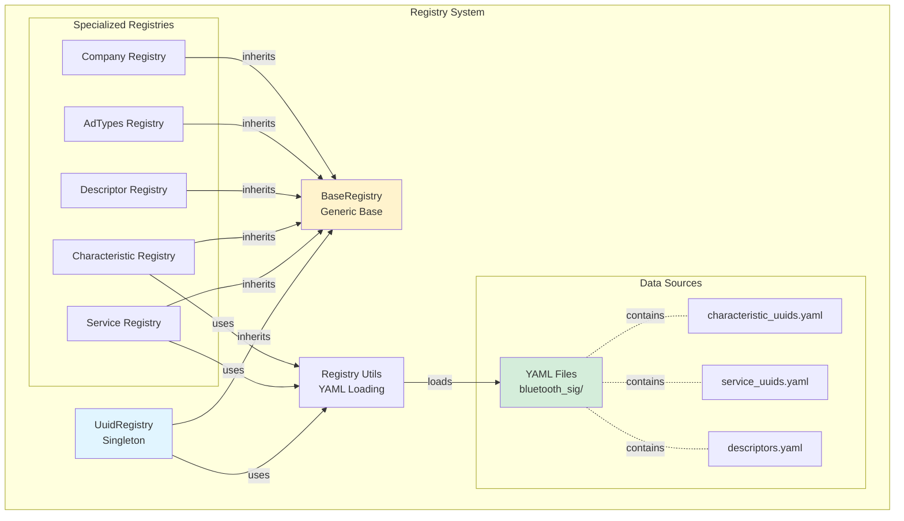
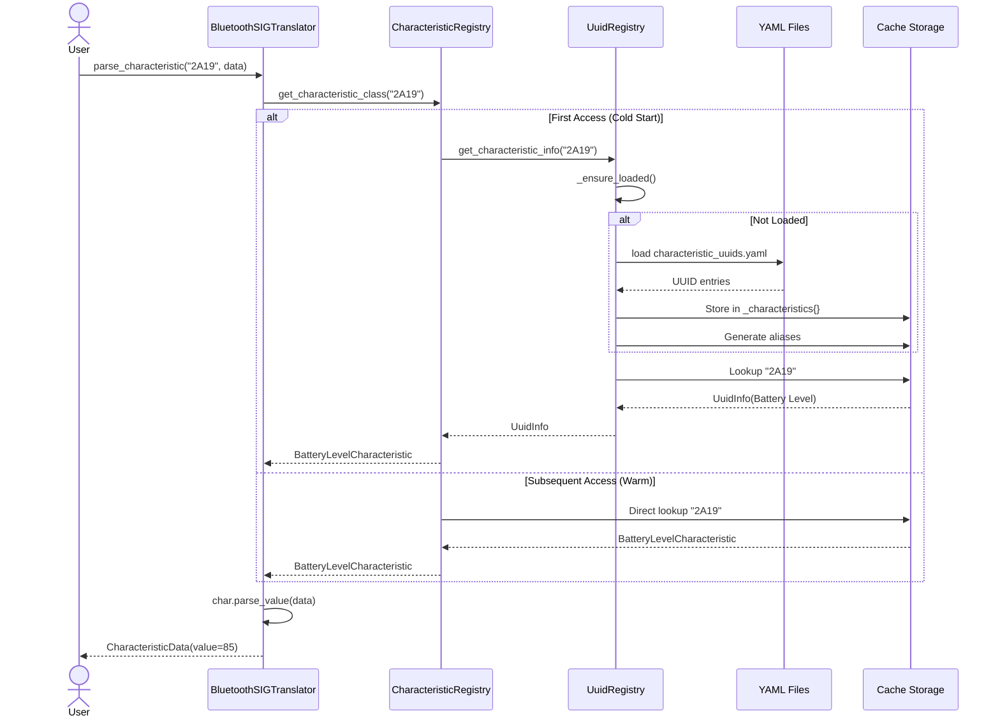

# Registry System Deep Dive

!!! info "Audience"
    This guide is for **contributors and maintainers** who need to understand how the Bluetooth SIG registry system works. For general usage, see the [User Guides](../../how-to/ble-integration.md).

## Overview

The registry system is the foundation for UUID resolution in bluetooth-sig-python. It loads official Bluetooth SIG specifications from YAML files and provides thread-safe, cached lookups for characteristics, services, descriptors, and related metadata.

## Component Architecture (C4 Model - Component Level)



## Data Flow: UUID Resolution

The diagram below shows how [BluetoothSIGTranslator][bluetooth_sig.core.translator.BluetoothSIGTranslator], [CharacteristicRegistry][bluetooth_sig.gatt.characteristics.registry.CharacteristicRegistry], and [UuidRegistry][bluetooth_sig.gatt.uuid_registry.UuidRegistry] work together to resolve UUIDs:



## Data Source Dependencies

### Bluetooth SIG YAML Files

The registry system loads official Bluetooth SIG specifications from YAML files located in the `bluetooth_sig/` package. These files contain canonical UUID definitions, characteristic specifications, service definitions, and related metadata.

!!! note "Setup Requirement"
    The library requires the `bluetooth_sig` package data to be available. For installation instructions, see the [Installation Guide](../../tutorials/installation.md).

### Data Source Resolution

The registry system searches for YAML data files using a fallback strategy:

1. **Development environment**: Relative to project root
2. **Installed package**: Within the installed package location

This dual-path approach ensures the library works correctly in both development and production environments. The [`find_bluetooth_sig_path()`](https://github.com/RonanB96/bluetooth-sig-python/blob/main/src/bluetooth_sig/registry/utils/yaml_cross_reference.py) utility function handles path resolution automatically.

## UuidRegistry: The Central Hub

**Location**: `src/bluetooth_sig/gatt/uuid_registry.py` (821 lines)

### Purpose

The [UuidRegistry][bluetooth_sig.gatt.uuid_registry.UuidRegistry] class is a **singleton** that:

1. Loads all Bluetooth SIG UUIDs from YAML files
2. Provides fast lookup by UUID, name, or ID
3. Caches results for performance
4. Supports custom UUID registration
5. Handles alias generation for flexible lookup

### Data Structures

The [UuidRegistry][bluetooth_sig.gatt.uuid_registry.UuidRegistry] maintains several internal storage structures optimized for fast lookups:

- **Canonical storage**: Direct UUID-keyed dictionaries for services, characteristics, descriptors, and units
- **Alias mappings**: Lightweight string-to-string mappings enabling flexible name-based lookups
- **Custom registrations**: Separate storage for runtime-registered UUIDs
- **Thread safety**: Uses `threading.RLock()` for concurrent access protection

This dual-storage approach (canonical + aliases) minimizes memory usage while supporting multiple lookup patterns. For complete implementation details, see the [UuidRegistry][bluetooth_sig.gatt.uuid_registry.UuidRegistry] source code.

### CharacteristicInfo Structure

The [CharacteristicInfo][bluetooth_sig.types.CharacteristicInfo] struct stores metadata about Bluetooth characteristics loaded from SIG specifications. It extends the base [SIGInfo][bluetooth_sig.types.base_types.SIGInfo] type with characteristic-specific fields including value type and unit information.

See the [CharacteristicInfo][bluetooth_sig.types.CharacteristicInfo] API reference for the complete field list and usage examples.

### CharacteristicSpec Structure

For characteristics requiring detailed specifications, the [CharacteristicSpec][bluetooth_sig.types.gatt_services.CharacteristicSpec] struct provides enriched metadata including:

- **Field information**: Structure and data type details
- **Unit metadata**: Physical units and symbols
- **Descriptions**: Human-readable explanations

This richer specification is used when cross-referencing YAML files from the Bluetooth SIG GATT Specification Supplement (GSS). See the [CharacteristicSpec][bluetooth_sig.types.gatt_services.CharacteristicSpec] source code for complete details.

## Lazy Loading Pattern

### Double-Checked Locking

The registry uses **double-checked locking** for thread-safe lazy initialization:

1. **First check** (no lock): Fast path for already-initialized registry
2. **Acquire lock**: Only when initialization needed
3. **Second check** (with lock): Prevents race conditions if another thread initialized during wait
4. **Load data**: Perform actual YAML loading
5. **Set flag**: Mark as loaded

This pattern minimizes lock contention while guaranteeing thread safety. See [UuidRegistry][bluetooth_sig.gatt.uuid_registry.UuidRegistry] source code for implementation details.

### State Machine Diagram

```mermaid
stateDiagram-v2
    [*] --> Uninitialized
    Uninitialized --> CheckingLoad : First Access
    CheckingLoad --> AcquiringLock : Not Loaded
    CheckingLoad --> Loaded : Already Loaded (Fast Path)

    AcquiringLock --> DoubleCheck : Lock Acquired
    DoubleCheck --> Loading : Still Not Loaded
    DoubleCheck --> Loaded : Another Thread Loaded

    Loading --> ParsingYAML : Read Files
    ParsingYAML --> BuildingIndex : Parse Entries
    BuildingIndex --> GeneratingAliases : Create Mappings
    GeneratingAliases --> Loaded : Set _loaded=True

    Loaded --> [*]

    note right of CheckingLoad
        Lock-free check
        O(1) constant time
    end note

    note right of Loading
        Only happens once
        10-50ms typical
    end note

    note right of Loaded
        All future accesses
        Skip directly here
    end note
```### Why Double-Checked Locking?

**Performance Benefits**:

- **Fast Path**: After initialization, `_loaded` check succeeds immediately (no lock)
- **Cold Start**: First access acquires lock once, subsequent accesses skip lock
- **Thread Safe**: No race conditions during initialization

**Memory Efficiency**:

- Data loaded **only once** even with concurrent access
- All threads share the same registry instance (singleton)

### Loading Process

The registry loading process follows these steps:

1. **Locate data source**: Find `bluetooth_sig/` package using `find_bluetooth_sig_path()`
2. **Load YAML files**: Parse service, characteristic, descriptor, and unit YAML files
3. **Normalize UUIDs**: Convert all UUID formats to canonical 128-bit representation
4. **Create info objects**: Build [CharacteristicInfo][bluetooth_sig.types.CharacteristicInfo] and [ServiceInfo][bluetooth_sig.types.ServiceInfo] structs
5. **Store canonically**: Index by normalized UUID in main dictionaries
6. **Generate aliases**: Create name-based lookup mappings

The loading is performed only once per application lifetime, with graceful degradation if YAML files are missing. See [UuidRegistry][bluetooth_sig.gatt.uuid_registry.UuidRegistry] for the complete implementation.

## Alias System

### Flexible Lookup

The alias system enables flexible UUID lookup using various identifiers:

- **UUID**: `"2A19"`, `"0x2A19"`, `"00002A19-0000-1000-8000-00805F9B34FB"`
- **Name**: `"Battery Level"`, `"battery level"`, `"battery_level"`
- **Org ID**: `"org.bluetooth.characteristic.battery_level"`

### Storage Strategy

**Canonical Storage + Lightweight Aliases**:

The [UuidRegistry][bluetooth_sig.gatt.uuid_registry.UuidRegistry] implements a **canonical storage + lightweight aliases** pattern:

1. **Store once**: Full [CharacteristicInfo][bluetooth_sig.types.CharacteristicInfo] stored with normalized UUID as key
2. **Generate aliases**: Create multiple lookup keys (name, ID, variations)
3. **Map aliases**: Lightweight string → canonical key mappings
4. **Normalize**: All aliases lowercase for case-insensitive lookup

**Memory Efficiency**:

- Full [`UuidInfo`](https://github.com/RonanB96/bluetooth-sig-python/blob/main/src/bluetooth_sig/types/uuid.py) stored **once** (canonical)
- Aliases are just `str → str` mappings (lightweight)
- All aliases point to the same canonical info

### Alias Generation

The registry generates multiple alias variations for flexible lookup:

- **Name variations**: Original name, lowercase, title case
- **Org ID**: Full Bluetooth SIG identifier (e.g., `org.bluetooth.characteristic.battery_level`)
- **Short forms**: ID with prefix removed (e.g., `battery_level`)
- **Space/underscore variants**: Support both naming conventions

Example for Battery Level characteristic:
- `"battery level"` (lowercase)
- `"Battery Level"` (title case)
- `"org.bluetooth.characteristic.battery_level"` (org ID)
- `"battery_level"` (short form)

See the [UuidRegistry][bluetooth_sig.gatt.uuid_registry.UuidRegistry] implementation for the complete alias generation logic.

### Lookup Process

```mermaid
flowchart TD
    Start([get_characteristic_info<br/>identifier])
    EnsureLoad{Registry<br/>Loaded?}
    LoadData[Load YAML Files]
    CheckType{identifier<br/>type?}

    IsUUID[BluetoothUUID]
    IsString[String]

    TryParse{Parse as<br/>UUID?}
    ParseSuccess[Extract normalized UUID]
    ParseFail[Not a UUID]

    UUIDLookup[Lookup in _characteristics]
    AliasLookup[Lookup in _characteristic_aliases]

    GetCanonical[Get canonical key]
    FetchData[Fetch from _characteristics]

    CheckCustom[Check _custom_characteristics]

    ReturnInfo([Return UuidInfo])
    ReturnNone([Return None])

    Start --> EnsureLoad
    EnsureLoad -->|No| LoadData
    LoadData --> CheckType
    EnsureLoad -->|Yes| CheckType

    CheckType -->|BluetoothUUID| IsUUID
    CheckType -->|str| IsString

    IsUUID --> ParseSuccess
    IsString --> TryParse

    TryParse -->|Success| ParseSuccess
    TryParse -->|ValueError| ParseFail

    ParseSuccess --> UUIDLookup
    ParseFail --> AliasLookup

    UUIDLookup -->|Found| ReturnInfo
    UUIDLookup -->|Not Found| CheckCustom

    AliasLookup -->|Found| GetCanonical
    AliasLookup -->|Not Found| ReturnNone

    GetCanonical --> FetchData
    FetchData --> ReturnInfo

    CheckCustom -->|Found| ReturnInfo
    CheckCustom -->|Not Found| ReturnNone

    style Start fill:#e1f5ff
    style ReturnInfo fill:#d4edda
    style ReturnNone fill:#f8d7da
    style LoadData fill:#fff3cd
```

The lookup process follows the flowchart above, attempting multiple resolution strategies:

1. **Direct UUID**: If identifier is `BluetoothUUID`, lookup directly
2. **Parse as UUID**: Try parsing string as UUID format
3. **Alias lookup**: If not a UUID, search alias mappings
4. **Canonical retrieval**: Resolve alias to canonical key, fetch info
5. **Custom fallback**: Check runtime-registered custom UUIDs

This multi-strategy approach supports various identifier formats while maintaining O(1) lookup performance. See [UuidRegistry.get_characteristic_info][bluetooth_sig.gatt.uuid_registry.UuidRegistry.get_characteristic_info] for implementation details.## BaseRegistry Pattern

**Location**: `src/bluetooth_sig/registry/base.py`

All specialized registries inherit from [BaseUUIDRegistry][bluetooth_sig.registry.base.BaseUUIDRegistry], which provides:

**Core Functionality**:
- **Singleton pattern**: Thread-safe instance creation with double-checked locking
- **Lazy loading**: Data loaded only when first accessed
- **Generic typing**: Type-safe registry implementations via `Generic[T]`
- **Template methods**: Subclasses implement `_load()` for their specific data

**Key Methods**:
- `get_instance`: Retrieves singleton instance
- `_lazy_load`: Helper for double-checked locking pattern
- `_ensure_loaded`: Guarantees data is loaded before access

This base class ensures consistent behavior across all registry types. See [BaseUUIDRegistry][bluetooth_sig.registry.base.BaseUUIDRegistry] source code for complete details.

### Singleton Guarantees

The [BaseUUIDRegistry][bluetooth_sig.registry.base.BaseUUIDRegistry] pattern provides two key guarantees:

**Thread-Safe Singleton Creation**: Multiple threads calling `get_instance()` simultaneously will receive the same instance, created exactly once through double-checked locking.

**Lazy Loading**: Data is loaded on first access only. If multiple threads access data concurrently during initialization, the YAML loading happens exactly once while other threads wait.

## Specialized Registries

### Core Registries

**Location**: `src/bluetooth_sig/registry/core/`

The core registries include `ADTypesRegistry`, `AppearanceValuesRegistry`, and `ClassOfDeviceRegistry`:

```python
from bluetooth_sig.registry.core.ad_types import ADTypesRegistry
from bluetooth_sig.registry.core.appearance_values import (
    AppearanceValuesRegistry,
)
from bluetooth_sig.registry.core.class_of_device import ClassOfDeviceRegistry

# Advertising Data Types
ad_types_registry = ADTypesRegistry.get_instance()
ad_type_info = ad_types_registry.get_ad_type_info(0x01)  # Flags

# Appearance Values
appearance_registry = AppearanceValuesRegistry.get_instance()
heart_rate_sensor_appearance = (
    832  # Simulated appearance value for Heart Rate Sensor
)
appearance_info = appearance_registry.get_appearance_info(
    heart_rate_sensor_appearance
)

# Class of Device
cod_registry = ClassOfDeviceRegistry.get_instance()
audio_video_cod = 0x080204  # Simulated class of device value for Audio/Video
cod_info = cod_registry.decode_class_of_device(audio_video_cod)
```

### Company Identifiers

**Location**: `src/bluetooth_sig/registry/company_identifiers/`

The `CompanyIdentifiersRegistry` provides manufacturer ID lookups:

```python
from bluetooth_sig.registry.company_identifiers import (
    CompanyIdentifiersRegistry,
)

company_registry = CompanyIdentifiersRegistry.get_instance()
company_name = company_registry.get_company_name(0x004C)  # Apple Inc.
```

### UUID Registries

**Location**: `src/bluetooth_sig/registry/uuids/`

Multiple specialized registries for different UUID types:

- `BrowseGroupsRegistry` - Browse group UUIDs
- `DeclarationsRegistry` - Declaration attribute UUIDs
- `MembersRegistry` - Member service UUIDs
- `MeshProfilesRegistry` - Mesh profile UUIDs
- `ObjectTypesRegistry` - Object type UUIDs
- `ProtocolIdentifiersRegistry` - Protocol identifier UUIDs
- `SdoUuidsRegistry` - Standards Development Organization UUIDs
- `ServiceClassesRegistry` - Service class UUIDs
- `UnitsRegistry` - Unit UUIDs

## YAML File Format

### Characteristic UUID Example

```yaml
# bluetooth_sig/assigned_numbers/uuids/characteristic_uuids.yaml
uuids:
  - uuid: '0x2A19'
    name: Battery Level
    id: org.bluetooth.characteristic.battery_level
    source: null
    type: org.bluetooth.characteristic
    version: null
```

### Service UUID Example

```yaml
# bluetooth_sig/assigned_numbers/uuids/service_uuids.yaml
uuids:
  - uuid: '0x180F'
    name: Battery Service
    id: org.bluetooth.service.battery_service
    source: gss
    type: org.bluetooth.service
    version: null
```

### Unit Example

```yaml
# bluetooth_sig/assigned_numbers/units.yaml
units:
  - unit: '0x27AD'
    name: percentage
    symbol: '%'
    type: org.bluetooth.unit.percentage
```

## Caching Strategy

### What Gets Cached

1. **UUID → UuidInfo mappings**: Stored in `_characteristics`, `_services`, `_descriptors`
2. **Alias → Canonical UUID**: Lightweight string mappings
3. **Unit definitions**: Stored in `_units`
4. **Custom registrations**: Stored in `_custom_characteristics`, `_custom_services`

### Cache Invalidation

**Current Strategy**: No invalidation - data loaded once for application lifetime

**Rationale**:

- Bluetooth SIG specifications are stable (rarely change)
- Registry data is read-only after loading
- Application restart required for spec updates

**Future Enhancement**: A `reload()` method could be added for development/testing scenarios, clearing all cached data and forcing re-initialization. This would be useful when YAML files change during development but isn't needed for production use.

## Custom UUID Registration

### Runtime Registration

The [BluetoothSIGTranslator][bluetooth_sig.core.translator.BluetoothSIGTranslator] provides methods to register custom UUIDs at runtime:

```python
# SKIP: API demonstration - requires proper BaseCharacteristic/BaseGattService subclasses
from bluetooth_sig import BluetoothSIGTranslator

translator = BluetoothSIGTranslator.get_instance()

# Register custom characteristic
translator.register_custom_characteristic(
    uuid="ABCD1234",
    char_cls=MyCustomCharacteristic,
    override=False,  # Set True to override SIG characteristics
)

# Register custom service
translator.register_custom_service(
    uuid="ABCD5678", service_cls=MyCustomService, override=False
)
```

### Internal Storage

Custom UUID registration follows these steps:

1. **Ensure loaded**: Initialize registry if needed
2. **Normalize UUID**: Convert to canonical key format
3. **Create info object**: Build [CharacteristicInfo][bluetooth_sig.types.CharacteristicInfo] or [ServiceInfo][bluetooth_sig.types.ServiceInfo] with runtime origin marker
4. **Store separately**: Keep custom UUIDs in dedicated storage (not mixed with SIG specs)
5. **Generate aliases**: Enable name-based lookup for custom UUIDs too

Custom UUIDs are stored separately from SIG specifications but participate in the same lookup mechanisms. See [`UuidRegistry.register_custom_characteristic`](https://github.com/RonanB96/bluetooth-sig-python/blob/main/src/bluetooth_sig/gatt/uuid_registry.py) for implementation details.

## Performance Characteristics

### Initialization Cost

- **First Access**: ~10-50ms (load YAML files, parse, index)
- **Subsequent Access**: <0.1ms (cached lookup)

### Memory Footprint

- **Base Registry**: ~500KB-1MB (all Bluetooth SIG UUIDs)
- **Per Characteristic**: ~100-200 bytes (UuidInfo struct)
- **Aliases**: ~50 bytes each (string → string mapping)

### Lookup Performance

- **UUID Lookup**: O(1) - hash table lookup
- **Name Lookup**: O(1) - alias hash table → canonical key → data
- **Fuzzy Search**: O(n) - linear scan with string matching

### Thread Contention

- **Lock Acquisition**: Only during first access (initialization)
- **Read Operations**: Lock-free after initialization
- **Concurrent Reads**: Unlimited parallelism

## Error Handling

### Missing Submodule

If the `bluetooth_sig/` package data is not found, the registry:
- Logs a warning message
- Returns empty/limited data
- Continues operation (graceful degradation)
- Custom UUIDs still work normally

### Malformed YAML

When encountering invalid YAML files, the loader:
- Catches parsing exceptions
- Logs detailed error messages
- Returns empty lists (not crashes)
- Validates data structure before processing

### UUID Not Found

When a UUID cannot be resolved:
- Methods return `None` (not exceptions)
- Callers check for `None` and handle appropriately
- Typically fall back to `UnknownCharacteristic`
- Logging occurs at appropriate levels

**Philosophy**: The registry prioritizes **graceful degradation** over strict failure. Missing data is logged but doesn't prevent the library from functioning with available information.

## Design Principles

### Architecture Guidelines

1. **Lazy initialization**: Registry data loaded on first access, not at import time
2. **Canonical storage**: Single source of truth for each UUID, with lightweight aliases
3. **UUID normalization**: All UUIDs stored in normalized 128-bit format
4. **Graceful degradation**: Missing data logged as warnings, not raised as exceptions
5. **Thread safety**: Double-checked locking ensures safe concurrent access
6. **Singleton pattern**: Registry instances shared across entire application

## Observability

### Logging

The registry system uses Python's standard `logging` module with logger name `bluetooth_sig.gatt.uuid_registry`. Key events logged:

- **WARNING**: Missing YAML files, malformed data structures
- **ERROR**: Failed YAML parsing, invalid data formats
- **DEBUG**: Registry initialization, UUID lookups, cache operations

For troubleshooting registry issues, see the project's troubleshooting guide.

## Next Steps

- **[Internal Architecture](internals.md)** - Core implementation details
- **[Architectural Decisions](decisions.md)** - Why key design choices were made
- **[Adding Characteristics](../../how-to/adding-characteristics.md)** - Step-by-step implementation guide
