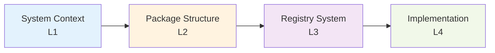

# C4 Architecture Model

The Bluetooth SIG Standards Library architecture is documented using the [C4 model](https://c4model.com/), which provides a hierarchical view of the system at different levels of abstraction.

## What is C4?

C4 stands for **Context, Containers, Components, and Code** - four levels of architectural diagrams that tell the story of a software system:

1. **Context (Level 1)** - System boundaries and external dependencies
2. **Container (Level 2)** - High-level technology choices and communication
3. **Component (Level 3)** - Major structural building blocks within containers
4. **Code (Level 4)** - Class diagrams and implementation details (optional)

## Our Architecture Levels

### Level 1: System Context

Shows how the library fits into the broader Bluetooth ecosystem.

**View**: [Design Decisions](decisions.md) (contains C4 Level 1 diagram in ADR-005)

**What you'll learn**:

- External dependencies (BLE connection libraries, Bluetooth SIG specs)
- System boundaries (what this library does vs what it doesn't do)
- Data flow (raw bytes → typed data)

### Level 2: Container (Package Structure)

Shows the main packages and their responsibilities.

**View**: [Internals](internals.md#package-structure-c4-model-container-level) (contains C4 Level 2 diagram)

**What you'll learn**:

- Core API layer (`bluetooth_sig.core`)
- GATT parsing layer (`bluetooth_sig.gatt`)
- Registry system (`bluetooth_sig.registry`)
- Type definitions (`bluetooth_sig.types`)
- Inter-package dependencies

### Level 3: Component (Registry System)

Zooms into the registry system to show internal components.

**View**: [Registry System](registry-system.md#component-architecture-c4-model-component-level) (contains C4 Level 3 diagram)

**What you'll learn**:

- Registry hierarchy and specialization
- YAML data source loading
- Lazy initialization patterns
- Thread safety mechanisms

### Level 4: Code (Implementation)

For code-level details, see:

- [Internals](internals.md) - Implementation patterns and key classes
- [API Reference](../../api/index.rst) - Complete class documentation

## Navigation Path

**Recommended reading order**:

1. Start with [Design Decisions](decisions.md) for system context
2. Read [Architecture Overview](overview.md) for principles
3. Deep dive into [Internals](internals.md) for container details
4. Explore [Registry System](registry-system.md) for component architecture

## Diagram Format

All C4 diagrams in this documentation use [Mermaid](https://mermaid.js.org/) syntax, which renders directly in the browser. This allows for:

- ✅ **Version control** - Diagrams live with code, not as binary images
- ✅ **Maintainability** - Update diagrams by editing Markdown
- ✅ **Consistency** - Unified syntax across all documentation
- ✅ **Accessibility** - Text-based diagrams are screen-reader friendly

## See Also

- [Architecture Overview](overview.md) - Core principles and patterns
- [Design Decisions](decisions.md) - Why we made specific choices
- [Internals](internals.md) - Implementation deep dive
- [C4 Model Official Site](https://c4model.com/) - Learn more about C4
