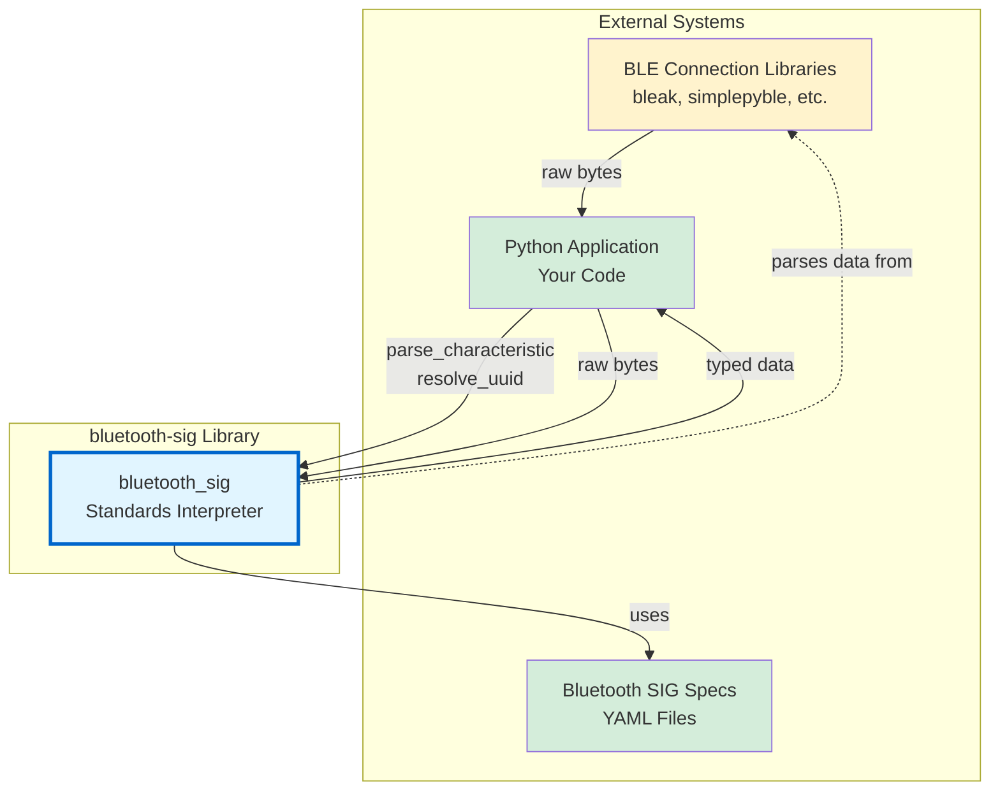
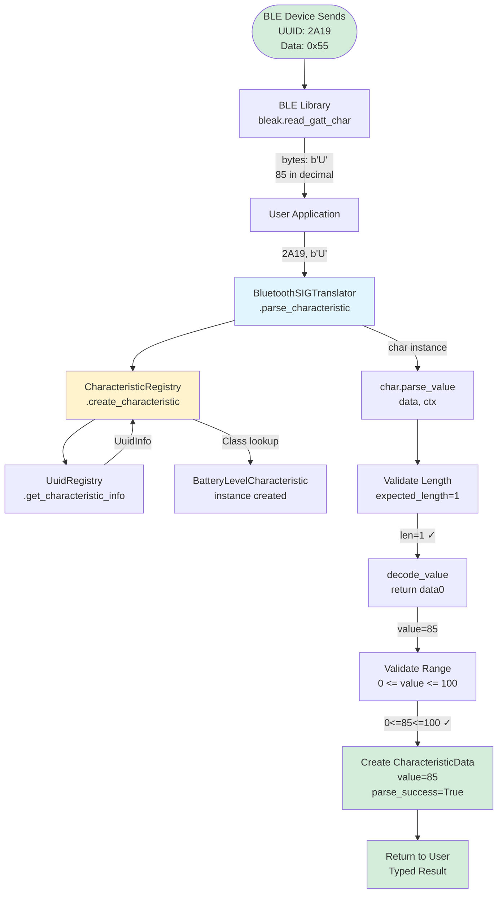
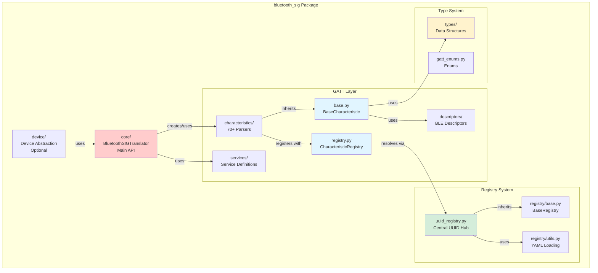
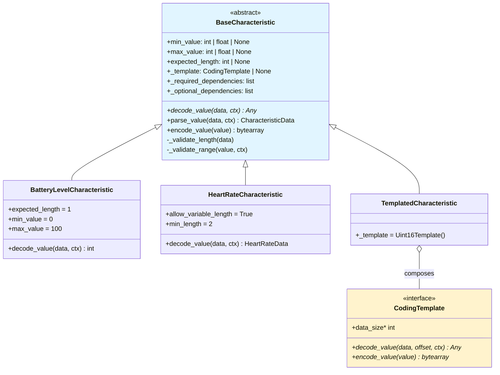
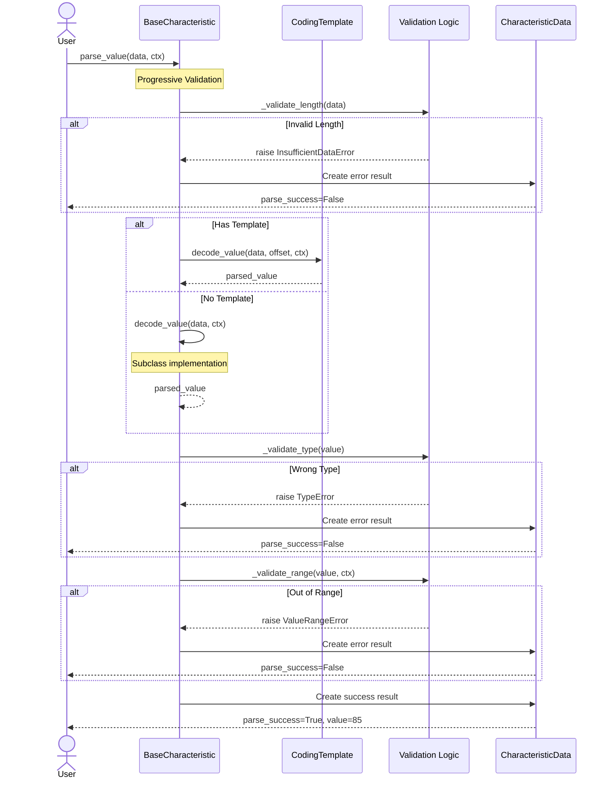

# Internal Architecture Guide

!!! info "Audience"
    This guide is for **contributors and maintainers** who need to understand the internal implementation details of the bluetooth-sig-python library. If you're looking to use the library in your project, see the [User Guides](../../how-to/ble-integration.md) instead.

## Overview

The internal architecture of bluetooth-sig-python is built around registry-driven characteristic resolution, template-based parsing composition, and strict separation between standards interpretation and BLE connectivity. This guide covers the implementation details of the core systems that power the library.

## System Context (C4 Model - Context Level)



## Complete Data Flow: Raw Bytes → Typed Data



<a id="package-structure-c4-model-container-level"></a>

## Package Structure (C4 Model - Container Level)



## BaseCharacteristic: The Foundation

### Purpose and Design

**Location**: `src/bluetooth_sig/gatt/characteristics/base.py`

The {py:class}`~bluetooth_sig.gatt.characteristics.base.BaseCharacteristic` class is the abstract base class for all GATT characteristic parsers.

### Class Hierarchy



### Parsing Flow with Validation



### Declarative Validation Pattern

Characteristics declare constraints as class attributes instead of implementing manual validation in `decode_value()`:

:::::{grid} 2
:gutter: 3

::::{grid-item}
**Before** (Manual Validation):

```python
def decode_value(self, data: bytearray) -> int:
    if len(data) != 1:
        raise ValueError("Need 1 byte")
    level = data[0]
    if not 0 <= level <= 100:
        raise ValueError("Must be 0-100")
    return level
```

::::

::::{grid-item}
**After** (Declarative):

```python
expected_length = 1
min_value = 0
max_value = 100

def decode_value(self, data: bytearray) -> int:
    return data[0]  # Validation automatic
```

::::

:::::

**Example**: :class:`~bluetooth_sig.gatt.characteristics.battery.BatteryLevelCharacteristic` declares `expected_length = 1`, `min_value = 0`, and `max_value = 100` as class attributes. The base class enforces these constraints before calling `decode_value()`.

**Benefits**:

- **Reduces boilerplate**: No repetitive validation code
- **Prevents errors**: Cannot forget validation steps
- **Improves consistency**: All characteristics validated uniformly
- **Enhances readability**: Constraints visible at class level

Validation can be disabled per-instance via `validate=False` parameter for testing or debugging non-compliant devices.

See {py:class}`~bluetooth_sig.gatt.characteristics.base.BaseCharacteristic` for available validation attributes.

### Template Composition System

**Location**: `src/bluetooth_sig/gatt/characteristics/templates.py`

Templates are reusable parsing strategies that can be composed into characteristics via the `_template` attribute. The `CodingTemplate` interface defines the contract for all parsing templates:

**Core Methods**:

- `decode_value()`: Convert raw bytes to typed value
- `encode_value()`: Convert typed value back to bytes
- `data_size`: Property indicating byte length

**Built-in Templates**:

- **Integer**: `Uint8Template`, `Uint16Template`, `Uint24Template`, `Uint32Template`, `Sint8Template`, `Sint16Template`, `Sint24Template`
- **Float**: `Float32Template`, `Float64Template`, `IEEE11073Template`
- **String**: `Utf8StringTemplate`
- **Specialized**: `PercentageTemplate`, `TemperatureTemplate`, `HumidityTemplate`

**Usage Example**:

Characteristics can use templates like `Uint16Template` to eliminate boilerplate. By setting `_template = Uint16Template()`, the characteristic automatically inherits 16-bit unsigned integer parsing without implementing `decode_value()`. This composition approach promotes code reuse and consistency across similar characteristics.

See the GATT API reference for characteristics and usage patterns.

### CharacteristicData: Parse Result Container

The {py:class}`~bluetooth_sig.gatt.characteristics.base.CharacteristicData` struct is the return type for all characteristic parsing operations:

**Structure**: Every parse operation returns a {py:class}`~bluetooth_sig.gatt.characteristics.base.CharacteristicData` instance containing:

- **Parsed value**: The decoded data (type varies by characteristic)
- **Success indicator**: Boolean flag for parse status
- **Error information**: Details when parsing fails
- **Back-reference**: Link to the characteristic that performed parsing
- **Raw data**: Original bytes for debugging
- **Field errors**: List of field-level parse errors
- **Parse trace**: Debug information for troubleshooting

**Convenience properties** like `name` and `uuid` proxy to the characteristic, making the result self-contained.

See {py:class}`~bluetooth_sig.gatt.characteristics.base.CharacteristicData` API reference for the complete field list and usage examples.

## CharacteristicRegistry: Discovery and Lookup

### Purpose

**Location**: `src/bluetooth_sig/gatt/characteristics/registry.py` (357 lines)

The {py:class}`~bluetooth_sig.gatt.characteristics.registry.CharacteristicRegistry` provides:

1. **Lazy Discovery** - Automatic discovery of characteristic classes via `pkgutil.walk_packages`
2. **UUID Resolution** - UUID → `CharacteristicName` enum → implementation class
3. **Name Resolution** - Display name → UUID → implementation class
4. **Thread Safety** - Double-checked locking for concurrent access
5. **Custom Registration** - Runtime registration of custom characteristics

### Registry Architecture

The characteristic registry uses a modern **function-based accessor pattern** instead of mutable globals:

```python
from bluetooth_sig.gatt.characteristics import get_characteristic_class_map

# Get current registry state
char_map = get_characteristic_class_map()
# Returns: dict[CharacteristicName, type[BaseCharacteristic]]
```

**Key Design Decisions**:

- ✅ **No mutable globals** - Functions return current registry state
- ✅ **Thread-safe** - Internal caching with double-checked locking
- ✅ **Lazy loading** - Registry populated on first access
- ✅ **Runtime discovery** - Automatically finds all characteristic classes

### Discovery Process

The registry automatically discovers characteristic classes at runtime:

```python
from bluetooth_sig.gatt.characteristics.registry import CharacteristicRegistry

# Registry discovers classes lazily
registry = CharacteristicRegistry.get_instance()

# Access triggers discovery and caching
char_class = registry.get_class_by_uuid("2A19")
```

**Discovery Flow**:

1. First access triggers `_lazy_load()` with double-checked locking
2. Walk package to find all `BaseCharacteristic` subclasses
3. Build UUID → class and enum → class mappings
4. Cache results for subsequent accesses

### Lookup Methods

The {py:class}`~bluetooth_sig.gatt.characteristics.registry.CharacteristicRegistry` provides multiple methods for discovering and instantiating characteristics:

```python
from bluetooth_sig.gatt.characteristics.registry import (
    CharacteristicName,
    CharacteristicRegistry,
)

# Create characteristic instance from UUID
char = CharacteristicRegistry.create_characteristic("2A19")

# Get characteristic class from UUID
CharClass = CharacteristicRegistry.get_characteristic_class_by_uuid("2A19")

# Get characteristic class from enum
CharClass = CharacteristicRegistry.get_characteristic_class(
    CharacteristicName.BATTERY_LEVEL
)

# Get all registered characteristics
all_chars = CharacteristicRegistry.get_all_characteristics()
```

### Thread Safety Pattern

**Double-Checked Locking**:

- First check: No lock (fast path for initialized registry)
- Second check: With lock (prevents race during initialization)
- Initialization: Happens exactly once, thread-safe

**Why this pattern?**

- **Performance**: Most accesses skip lock acquisition
- **Safety**: No race conditions during initialization
- **Lazy**: Only loads when first characteristic is created

## UUID Resolution System

### UuidRegistry: YAML-Based Resolution

**Location**: `src/bluetooth_sig/gatt/uuid_registry.py` (821 lines)

The `UuidRegistry` loads UUID mappings from Bluetooth SIG YAML files in the `bluetooth_sig/` git submodule.

### YAML Sources

```text
bluetooth_sig/assigned_numbers/
├── uuids/
│   ├── characteristic_uuids.yaml  # SIG characteristic UUIDs
│   ├── service_uuids.yaml         # SIG service UUIDs
│   ├── descriptors.yaml           # BLE descriptor UUIDs
│   └── units.yaml                 # Unit definitions
├── core/
│   ├── ad_types.yaml              # Advertising data types
│   ├── appearance_values.yaml     # Device appearance codes
│   └── class_of_device.yaml       # Class of Device (CoD)
└── company_identifiers/
    └── company_identifiers.yaml   # Manufacturer IDs
```

### CharacteristicSpec Structure

The `CharacteristicSpec` struct provides rich specification data for characteristics:

```python
import msgspec

from bluetooth_sig.types.registry.common import FieldInfo, UnitMetadata
from bluetooth_sig.types.uuid import BluetoothUUID


class CharacteristicSpec(msgspec.Struct, kw_only=True):
    """Characteristic specification from cross-file YAML references."""

    uuid: BluetoothUUID
    name: str
    field_info: FieldInfo | None = None
    unit_metadata: UnitMetadata | None = None
    description: str | None = None
```

### Lazy Loading with Caching

The `UuidRegistry` implements lazy loading with double-checked locking:

**First Access**:

1. Check `_loaded` flag (no lock - fast path)
2. If not loaded, acquire lock
3. Check `_loaded` again (prevents race)
4. Load YAML files from `bluetooth_sig/` package
5. Build UUID → info mappings
6. Generate lookup aliases
7. Set `_loaded = True`

**Subsequent Accesses**: Direct dictionary lookups (O(1), no lock)

This pattern ensures data loads exactly once even with concurrent access. See `UuidRegistry` for implementation details.

### Resolution Hierarchy

**SIGCharacteristicResolver** uses a fallback chain:

```text
1. YAML Cross-File Resolution (Preferred)
   ↓ Detailed specs with field info, unit info, data types
   ↓ Source: GSS (GATT Specification Supplement) YAML files

2. Basic Registry Resolution (Fallback)
   ↓ Simple UUID → name mapping
   ↓ Faster, less detailed

3. Hardcoded _info Attribute (Custom Only)
   ↓ For vendor-specific characteristics not in SIG registry
   ↓ Defined in custom characteristic classes
```

## Resolver: Name Normalization and Variants

**Location**: `src/bluetooth_sig/gatt/resolver.py`

### NameNormalizer

Converts between different name formats:

- **CamelCase → Display**: `BatteryLevelCharacteristic` → `"Battery Level"`
- **Handles acronyms**: Preserves `HTTP`, `UUID`, etc.
- **Removes suffixes**: Strips `"Characteristic"` suffix

### NameVariantGenerator

Generates all possible name variations for lookup:

- Class name
- Display name (with/without "Characteristic")
- snake_case
- UPPER_CASE
- Various spacing/underscore combinations

### CharacteristicRegistrySearch

Fuzzy matching for characteristic lookup:

- Case-insensitive search
- Handles underscores/spaces interchangeably
- Supports partial matches
- Strips special characters

See the resolver module API reference for complete implementation.

## BluetoothSIGTranslator: The Singleton API

**Location**: `src/bluetooth_sig/core/translator.py` (935 lines)

The {py:class}`~bluetooth_sig.core.translator.BluetoothSIGTranslator` class provides the main high-level API for parsing and UUID resolution.

### Singleton Pattern

The {py:class}`~bluetooth_sig.core.translator.BluetoothSIGTranslator` implements the singleton pattern, ensuring a single global instance manages all UUID resolution and characteristic parsing. The singleton is lazily initialized on first access and shared across the entire application.

See `BluetoothSIGTranslator.get_instance` for usage.

### Key Methods

**Parsing**:

The `parse_characteristic` method is the primary entry point for parsing characteristic data. It takes a UUID (string or `BluetoothUUID`) and raw bytes, then:

1. Resolves UUID to characteristic class
2. Instantiates the characteristic
3. Calls the characteristic's parse method
4. Returns {py:class}`~bluetooth_sig.gatt.characteristics.base.CharacteristicData` with results

Optionally accepts `CharacteristicContext` for multi-characteristic parsing scenarios.

**UUID Resolution**:

The `get_characteristic_info` method retrieves characteristic metadata by UUID or name, returning {py:class}`~bluetooth_sig.types.CharacteristicInfo` with details like value type and units.

The `get_characteristic_uuid_by_name` method performs the reverse operation, resolving a `CharacteristicName` enum to its `BluetoothUUID`.

**Service Operations**:

The `create_service` method instantiates service objects from UUIDs, while `process_services` provides batch processing:

- **Input**: Nested dictionary of service UUID → characteristic UUID → bytes
- **Output**: Nested dictionary of service UUID → characteristic UUID → {py:class}`~bluetooth_sig.gatt.characteristics.base.CharacteristicData`
- **Usage**: Parse all characteristics from a BLE device in one call

**Custom Registration**:

The `register_custom_characteristic` method allows runtime registration of custom characteristics:

- Registers vendor-specific UUIDs not in SIG specifications
- Optionally overrides SIG characteristics (use carefully!)
- Makes custom characteristics available through standard lookup methods
- See [Custom Characteristics Guide](../../how-to/adding-characteristics.md) for detailed usage

## Progressive API Levels

The library supports 4 progressive levels of sophistication:

### Level 1: Basic Parsing (Required)

**Minimum implementation** - just implement `decode_value`:

The simplest characteristic only needs to implement the `decode_value()` method, converting raw bytes to a typed value. No validation, no templates, just parsing logic.

See [Adding Characteristics Guide](../../how-to/adding-characteristics.md) for step-by-step instructions.

### Level 2: Declarative Validation (Optional)

**Add validation attributes**: Declare `expected_length`, `min_value`, `max_value`, and `expected_type` as class attributes. The base class automatically validates these constraints before calling `decode_value()`, eliminating boilerplate validation code.

**Validation control**: Pass `validate=False` to the constructor to disable validation for permissive parsing, testing, or debugging non-compliant devices. Validation is enabled by default.

### Level 3: Template Composition (Optional)

**Use reusable template**: Set `_template = Uint16Template()` (or any other `CodingTemplate`). The template handles all decoding/encoding, so you don't need to implement `decode_value()` at all. Perfect for characteristics that follow standard data types.

### Level 4: Dependency Resolution (Optional)

**Multi-characteristic parsing** with `CharacteristicContext`:

```python
# SKIP: Conceptual example - ContextInfoCharacteristic would be a real characteristic class
from bluetooth_sig.gatt.characteristics.base import BaseCharacteristic
from bluetooth_sig.gatt.context import CharacteristicContext


class DependentCharacteristic(BaseCharacteristic):
    _required_dependencies = [ContextInfoCharacteristic]

    def decode_value(self, data: bytearray, ctx: CharacteristicContext) -> int:
        # Access dependency from context
        context_info = ctx.dependencies.get("context_info")
        # Use dependency to enrich parsing
        return data[0] if context_info else 0
```

## Descriptor System

**Location**: `src/bluetooth_sig/gatt/descriptor_utils.py`

BLE descriptors provide runtime metadata about characteristics. The library integrates descriptors for enhanced validation and dynamic behaviour.

### Descriptor Types

```python
from bluetooth_sig.gatt.descriptors import (
    CCCDDescriptor,
    CharacteristicPresentationFormatDescriptor,
    CharacteristicUserDescriptionDescriptor,
    ValidRangeDescriptor,
)

# Client Characteristic Configuration Descriptor (CCCD)
cccd = CCCDDescriptor()

# Characteristic Presentation Format
format_desc = CharacteristicPresentationFormatDescriptor()

# Valid Range Descriptor
range_desc = ValidRangeDescriptor()

# User Description Descriptor
description_desc = CharacteristicUserDescriptionDescriptor()
```

### Descriptor Access Pattern

Characteristics can access descriptor data through the `CharacteristicContext`:

1. **Check for descriptor**: Query context for Valid Range, Presentation Format, etc.
2. **Use if available**: Apply descriptor-based validation/formatting
3. **Fall back to declarative**: Use class attributes if no descriptor present

This enables runtime validation that adapts to actual device capabilities. See the [BLE Integration Guide](../../how-to/ble-integration.md) for usage patterns.

## Exception Hierarchy

**Location**: `src/bluetooth_sig/gatt/exceptions.py`

The library defines a hierarchy of exceptions for different error conditions. All GATT-related exceptions inherit from `GattError`:

```python
class GattError(Exception):
    """Base exception for GATT layer."""


class ParseFieldError(GattError):
    """Field-level parsing error."""

    field_name: str
    field_value: Any
    expected_type: type | None


class InsufficientDataError(GattError):
    """Not enough bytes to parse."""

    required_bytes: int
    available_bytes: int


class ValueRangeError(GattError):
    """Value outside valid range."""

    value: Any
    min_value: Any | None
    max_value: Any | None


class UUIDResolutionError(GattError):
    """UUID not found in registry."""

    uuid: str


class MissingDependencyError(GattError):
    """Required dependent characteristic not available."""

    dependency_uuid: str
```

Common exceptions include `InsufficientDataError`, `ValueRangeError`, `UUIDResolutionError`, and `MissingDependencyError`.

## Key Design Patterns

### 1. Registry Pattern

- {py:class}`~bluetooth_sig.gatt.characteristics.registry.CharacteristicRegistry`: Global UUID → class lookup
- **Lazy Discovery**: Load on first access
- **Thread-Safe**: Double-checked locking

### 2. Singleton Pattern

- {py:class}`~bluetooth_sig.core.translator.BluetoothSIGTranslator`: Single global instance
- `UuidRegistry`: Single YAML loader
- `BaseRegistry`: All registries are singletons

### 3. Template Method Pattern

- `BaseCharacteristic.parse_value`: Orchestrates validation + decoding
- Subclasses implement `decode_value`
- Base class handles error wrapping

### 4. Composition over Inheritance

- `CodingTemplate`: Inject via `_template` attribute
- No deep inheritance hierarchies
- Reusable parsing strategies

### 5. Declarative Configuration

- **Validation attributes**: `expected_length`, `min_value`, `max_value`
- **Dependency attributes**: `_required_dependencies`, `_optional_dependencies`
- Reduces boilerplate, increases consistency

### 6. Progressive Enhancement

- **Level 1-4 API**: Start simple, add features as needed
- Backward compatible
- Low barrier to entry

## Architectural Decisions

For detailed explanations of key architectural decisions (why registry-driven resolution, double-checked locking, template composition, etc.), see [Architectural Decision Records](decisions.md).

## Performance Characteristics

### Initialization

| Operation | Time | Notes |
|-----------|------|-------|
| First characteristic access | 10-50ms | One-time registry discovery |
| YAML loading (first UUID lookup) | 10-30ms | One-time YAML parsing |
| Subsequent accesses | <0.1ms | Cached lookups |

### Memory Footprint

| Component | Size | Notes |
|-----------|------|-------|
| Base registry | 500KB-1MB | All Bluetooth SIG UUIDs |
| Per characteristic | 100-200 bytes | UuidInfo struct |
| Per alias | ~50 bytes | String → string mapping |

### Parsing Performance

| Characteristic Type | Time | Notes |
|---------------------|------|-------|
| Simple (Battery Level) | 1-2 µs | Single byte, range check |
| Template-based (Uint16) | 2-3 µs | Template delegation overhead |
| Complex (Heart Rate) | 5-10 µs | Conditional parsing, multiple fields |

### Thread Contention

- **Lock acquisition**: Only during first access
- **Read operations**: Lock-free after initialization
- **Concurrent reads**: Unlimited parallelism

## Performance Considerations

### Lazy Loading

- **Registry discovery**: Only on first characteristic creation
- **YAML loading**: Only on first UUID resolution
- **Module imports**: Only when characteristic is needed

### Caching

- **UUID → Enum mapping**: `@lru_cache` on lookup functions
- **Name normalization**: `@lru_cache` on variant generation
- **Descriptor data**: Cached in `CharacteristicContext`

### msgspec Structs

- **Fast serialization**: msgspec is 5-10x faster than dataclasses
- **Memory efficient**: Compact representation
- **Type validated**: Runtime type checking

### Thread Safety

- **Double-checked locking**: Minimize lock contention
- **Read-heavy workload**: Most operations are lock-free reads
- **Singleton registries**: Shared state, protected by locks

## Next Steps

- **[Registry System Deep Dive](registry-system.md)** - How YAML loading works
- **[Architectural Decisions](decisions.md)** - Why key design choices were made
- **[Adding Characteristics](../../how-to/adding-characteristics.md)** - Step-by-step implementation guide
