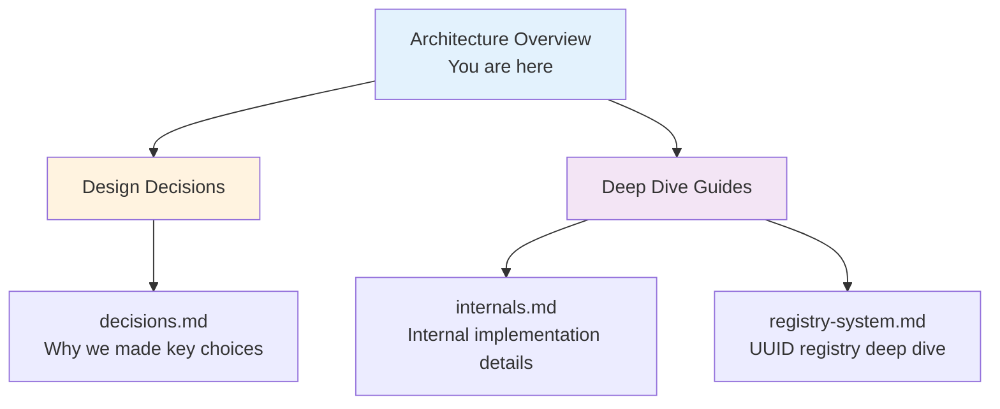
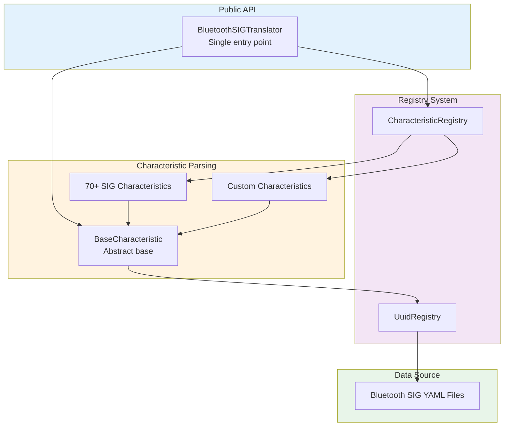

# Architecture Documentation

This section contains architecture documentation for contributors and maintainers.

## Documentation Structure

## Core Architecture Principles

### Framework-Agnostic Design

- Zero dependencies on BLE backends (bleak, simplepyble, etc.)
- Accepts `bytes`, returns typed Python objects
- You manage connections, we handle parsing

### Standards-Driven Parsing

- All logic follows official Bluetooth SIG specifications
- YAML data loaded from `bluetooth_sig/` git submodule
- Automatic compliance with specification updates

### Type Safety

- Complete type hints on all public APIs
- Dataclasses for structured data (no raw `dict`/`tuple`)
- Validation during parsing, not at usage time

### Lazy Loading with Thread Safety

- Registry data loads on first access
- Double-checked locking for concurrent safety
- Minimal startup overhead

## Key Patterns

| Pattern | Purpose | Location |
|---------|---------|----------|
| **Registry Pattern** | Dynamic discovery of characteristics | [internals.md](internals.md) |
| **Singleton Pattern** | Single translator/registry instances | [internals.md](internals.md) |
| **Template Method** | Abstract parsing contracts | [internals.md](internals.md) |
| **Lazy Initialization** | On-demand data loading | [registry-system.md](registry-system.md) |

## System Layers

## Documentation Map

### For Understanding Design

- **[Design Decisions](decisions.md)** - Architectural Decision Records explaining why key choices were made

### For Implementation Details

- **[Internal Architecture](internals.md)** - Detailed implementation of core systems
- **[Registry System](registry-system.md)** - Deep dive into UUID registry and YAML loading

### For Contributing

- **[Adding Characteristics](../../how-to/adding-characteristics.md)** - Step-by-step guide for new characteristics
- **[Contributing Guide](../../how-to/contributing.md)** - Development setup and workflows

### For Performance

- **[Performance Guide](../../how-to/performance-tuning.md)** - Optimization techniques
- **[Benchmarks](../../reference/benchmarks.md)** - Live benchmark results

## Visual Diagrams

### Package Dependencies

### Package Hierarchy

### Class Hierarchy

